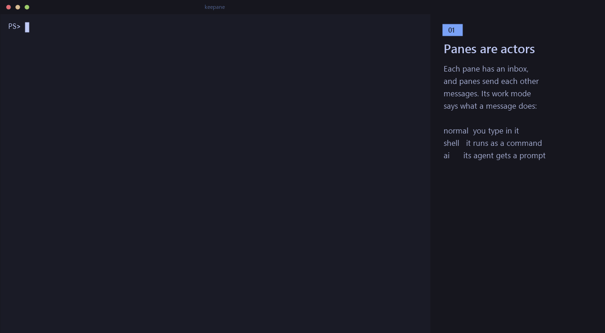
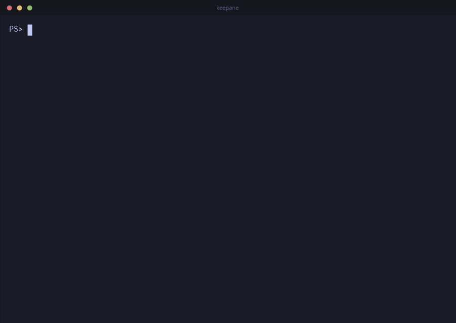
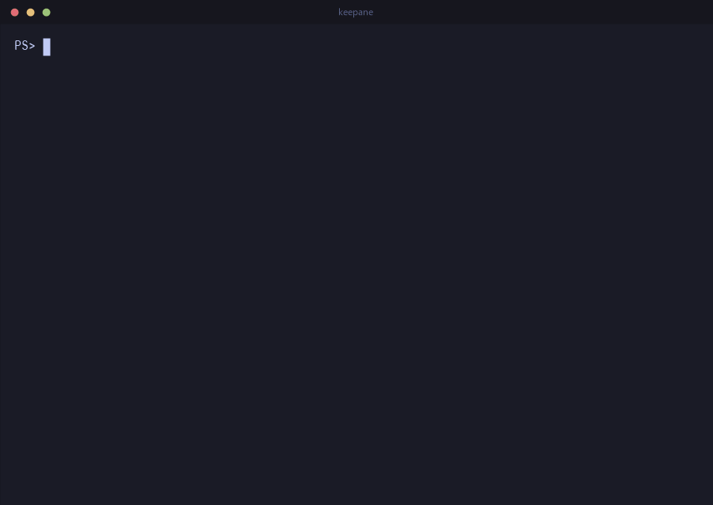
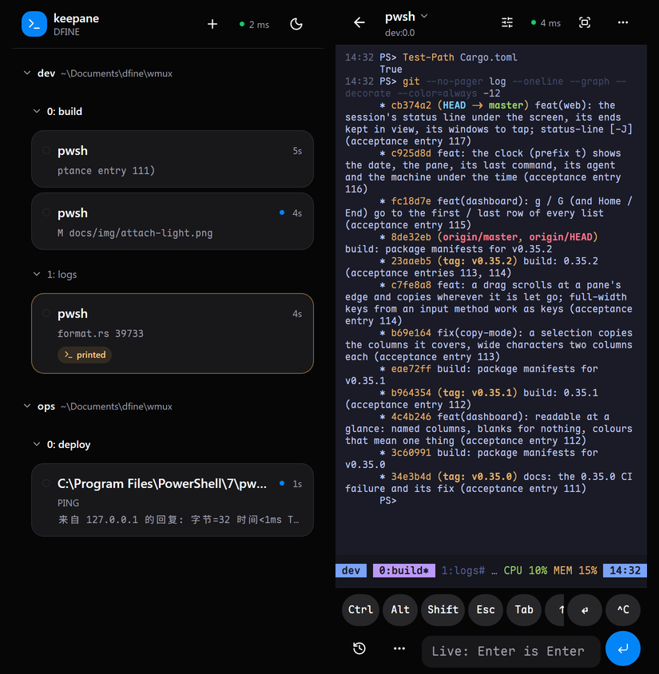

# keepane

[](https://github.com/newdee/keepane/actions/workflows/ci.yml)
[](https://github.com/newdee/keepane/releases)

[中文说明](README.zh-CN.md) · **[Feature tour →](https://dfine.tech/keepane/)** · [FAQ](docs/FAQ.md)

keepane is a terminal multiplexer. The programs in its panes
keep running after the terminal connection closes, and panes can pass
messages to each other through inboxes, on one computer or across two you
have paired. The usual tmux keys, commands and config file keep working.

<p align="center">
  <picture>
    <source media="(prefers-color-scheme: light)" srcset="docs/img/keepane-tour-light.gif">
    
  </picture>
</p>

- After you detach, the programs in the panes keep running. After a reboot,
  `keepane resume` brings the layout back; a pane closed by mistake comes
  back with `C-b u` within 10 seconds.
- Name a pane and you can send it messages. A message goes into the inbox
  first and is delivered when the pane is ready: a shell runs it when it
  is back at its prompt, other programs read it themselves.
- Every message carries an envelope of a fixed format, with the sender,
  the recipient and the task. The event log keeps 30 days; `C-b v` shows
  the panes, messages and tasks.
- People, scripts and AI agents use the same messages; an agent can also
  work through the built-in MCP server, and `keepane setup` hooks up Claude
  Code, Codex, Gemini CLI, Cursor CLI or opencode so that it is handed its
  next message when a turn ends.
- Two computers on one network or on Tailscale pair once, the way
  `ssh-copy-id` works, and from then on panes on one send messages and
  commands to panes on the other (`keepane link`). What comes from another
  machine reaches agents only, unless you allow shells on this one.
- On your phone, over Wi-Fi or Tailscale, `keepane web` shows every window
  and pane, whether each is busy or free and what waits in its inbox; what
  you type there runs on the computer.
- tmux's `C-b` prefix, splits, copy mode, command line, config syntax
  (`keepane import-config` brings a `.tmux.conf` over), format strings,
  hooks and plugins are there.

It runs on Windows (ConPTY), with PowerShell, WSL and cmd in the panes, and
on Linux and macOS, with bash and zsh.

## Send work between panes

Every pane has an inbox and can be given a name. Messages queue up and are
delivered according to the receiving pane's work mode.

<p align="center">
  <picture>
    <source media="(prefers-color-scheme: light)" srcset="docs/img/keepane-messages-light.gif">
    
  </picture>
</p>

```powershell
keepane rename-pane -t %3 builder          # -t %builder finds it from now on
keepane set-work-mode -t %builder shell    # it runs what it gets, at its prompt (from outside keepane; inside, a pane sets its own)
keepane send-message -t %builder -w 30 "cargo test"
#12 delivered to $1:@2.%3 (shell)
keepane trace-message 12 -w 600            # waits until it is done: output, success
```

A target can be `%7` (a pane id), `%builder` (a name), or `$1:@2.%7`
(session, window and pane; `whoami` shows it). A full address also pins
where the pane is: if the pane has been moved to another window, the
delivery fails.

A pane handles messages according to its work mode:

| Mode | Ready when | Delivery |
|---|---|---|
| `normal` (default) | never on its own | read with `read-message`; the window's flags show `@` |
| `shell` | keepane's prompt hook sees the shell back at its prompt | typed in and run |
| `ai` | the agent's end-of-turn hook runs `pane-ready` | typed in as a prompt |

The status line shows the current pane's mode (`ai` and `shell` marked out,
`normal` dim), and `C-b q` writes each pane's name and mode under its
number. A `status-right` of your own shows it with `#{pane_work_mode}`.

After someone types into a pane, keepane treats it as busy until the next
ready signal, so a message never lands in the middle of what is being
typed. If someone presses keys while a command keepane delivered is
running, the prompt that ends that command does not trigger a new message
either; what a user types ahead during a command of their own is beyond
keepane's reach.

In `ai` mode, if the agent has exited and a shell prompt shows again,
nothing is delivered. A message is delivered the way the recipient's mode
was when it was sent: text sent to an agent is never run as a shell
command, even if the mode changes in between.

Every message carries a header of fixed fields, with its source and route:

```text
[keepane id=12 task=12 from=$1:@1.%3 name=lead mode=ai to=$1:@2.%7 via=shell hop=0]
```

Each field is `name=value`, separated by spaces; no value holds a space,
so a program reads it back by splitting. `set -g message-envelope json`
writes the same fields as one line of JSON instead
(`{"keepane":1,"id":12,…}`), as before 0.17; the event log always keeps
the JSON.

Delivered to a shell, the header goes before the command in a form that
runs nothing and stays in the history: a comment in PowerShell
(`<# [keepane …] #> cargo test`), the argument of `:` in bash and zsh
(`: '[keepane …]'; cargo test`). Several lines are joined into one command
that runs them together, with one result (in bash and zsh, the last
line's). Delivered to an agent, it is the header, the text and the end
line `[keepane end=12]`. `task` ties together the order, the work and the
replies; `hop` counts how many times a message was passed on, and past
`message-hop-limit` (8 by default) it is refused, so agents cannot answer
each other in a loop.

The fields a sender chooses are given by name: `--to` (the pane; `-t` for
short), `--re 12` (it answers message 12, and goes to 12's sender unless
`--to` says otherwise; `-r` answers the message the pane is working on)
and `--task 12` (it carries task 12 on). The rest is keepane's to fill in:
who sent it (`from`, `name`, `mode`), its number, its hop and `via`. A
sender cannot set them, so a header can be trusted and the hop limit
holds:

```powershell
keepane send-message --to %builder "cargo test"
keepane send-message --re 12 "the tests pass"          # to whoever sent #12
keepane send-message --to %lead --task 12 "one more thing"
```
Run inside a pane, `set-work-mode` changes only that pane; run from a
terminal outside keepane, a key or the `C-b :` prompt, it can change any
pane. So a program in a pane cannot switch another pane into `shell` mode,
which runs its messages by itself. Renaming, managing inboxes and closing
panes are not limited by this; a close can be undone with `C-b u` within
10 seconds. The rule is there to cut down on mistakes, not to isolate
processes of the same user from each other.

## The dashboard

`C-b v` (a popup) or `keepane dashboard` (any terminal) lays everything out in
panels, lazygit style. On the left: `[1]` every pane, grouped by session, with
its work mode, whether it is free, its inbox, how long it has been quiet and
its program; `[2]` the chosen pane's inbox; `[3]` the tasks. On the right,
`[0]` the chosen pane: its address, directory, pid, how long it has run, what
it says it is doing, and then its screen live (with its colours), its
scrollback, its events, or the message or task under the cursor: moving onto
one in `[2]` or `[3]` shows it at once, laid out (its stage on its colour, who
sent it to whom, when each step came, then its text and what it printed; a
task, its messages joined down the left). Tab, `1 2 3 0` and `h`/`l` move
between panels, `j`/`k` within one, `[`/`]` change what the right side shows;
the mouse clicks and scrolls; `?` lists every key.

It also acts. On a pane: `s` sends it a message, `r` renames it, `m`
changes its work mode, `R` marks it ready (unsticks it), `o` goes there
(and closes the popup), `x` closes it. In the inbox: `d` deletes a queued
message (`u` brings it back), `K`/`J` move it, `t` puts it first, Enter
moves into it to scroll. Closing a pane, deleting a message and switching a pane
to `shell` (where what it gets is run) ask first. The design:
[docs/design/dashboard.md](docs/design/dashboard.md).

Messages and changes to panes are written to an event log,
`%LOCALAPPDATA%\keepane\events\<socket>\2026-09-26.jsonl`, kept for 30 days
(`event-log`, `event-log-days`, `event-log-max`). `list-tasks`,
`show-task`, `trace-message` and `list-events` read it. When the server
stops, messages not yet delivered are dropped, and the log says so. Pane
names and work modes are saved with the session. The design in detail:
[docs/design/mailbox.md](docs/design/mailbox.md).

## Install

keepane keeps its files (logs, the event log, saved sessions, pane history)
in its data directory: `%LOCALAPPDATA%\keepane` on Windows,
`~/.local/share/keepane` on Linux, `~/Library/Application Support/keepane`
on macOS. The paths below are written the Windows way.

### Linux and macOS

With [Homebrew](https://brew.sh) (macOS on Apple silicon or Intel, Linux
x86_64):

```bash
brew install newdee/tap/keepane
```

`brew upgrade keepane` takes a new version. Or from the
[releases page](https://github.com/newdee/keepane/releases):
`keepane-v<version>-linux-x86_64.tar.gz` (a static build that runs on any
x86_64 Linux), `keepane-v<version>-macos-aarch64.tar.gz` (Apple silicon) or
`keepane-v<version>-macos-x86_64.tar.gz` (Intel). Unpack it and put
`keepane` on your `PATH`:

```bash
tar xzf keepane-v<version>-linux-x86_64.tar.gz
install keepane-v<version>-linux-x86_64/keepane ~/.local/bin/
```

Or build it (below). The server listens on a socket in
`$XDG_RUNTIME_DIR/keepane-<uid>/` (else `/tmp/keepane-<uid>/`), a directory
only you can open. `keepane startup`, `keepane update` and the Windows
Terminal profile are Windows matters: on Linux and macOS, start the server
from your login files if you want it at logon, and update it the way you
installed it (`brew upgrade keepane`, or the releases page; `keepane update`
says which).

### Windows

keepane needs Windows 10 1809 or newer (for ConPTY). From the
[releases page](https://github.com/newdee/keepane/releases):

- `keepane-v<version>-windows-x86_64.zip` holds one folder,
  `keepane-v<version>-windows-x86_64`, with `keepane.exe` in it. Unzip it
  and put that folder on your `PATH`. No administrator rights needed.
- `keepane-<version>-windows-x86_64.msi` installs into `Program Files` for
  every user and puts `keepane` on the system `PATH`; it uninstalls from
  "Apps & features". It needs administrator rights (unattended:
  `msiexec /i keepane-<version>-windows-x86_64.msi /qn`).
- `keepane-<version>-windows-x86_64-user.msi` installs for you alone, into
  `%LOCALAPPDATA%\Programs\keepane`, and puts it on your `PATH`. Neither it
  nor `keepane update` needs administrator rights, so both work over SSH.

Scoop installs the zip straight from the manifest in this repository, with
no administrator rights:

```powershell
scoop install https://raw.githubusercontent.com/newdee/keepane/master/packaging/scoop/keepane.json
```

Over SSH, Windows 11 does not let the session go through a junction made
without administrator rights, and Scoop's `current` folder is one: the shim
fails with "The path cannot be traversed because it contains an untrusted
mount point". Point Scoop's shims at the version folder instead:

```powershell
scoop config no_junction true
scoop reset keepane
```

Over SSH, the per-machine MSI's permission prompt appears on a desktop where
nobody can answer it; `keepane update` says so and stops. Use the per-user
MSI, the zip or Scoop there.

WinGet manifests for the MSI are in `packaging/winget/` (validated with
`winget validate`); `winget install newdee.keepane` works once they are
merged into winget-pkgs, and until then
`winget install --manifest packaging/winget/manifests/n/newdee/keepane/<version>`
from a clone does the same. See `packaging/README.md`.

### From source

Building from source needs Rust 1.88 or newer:

```bash
cargo install --git https://github.com/newdee/keepane --locked   # latest master
cargo install --path .                                         # a local clone
```

To build the Windows MSI, the script downloads WiX for the occasion if it
is not installed:

```powershell
cargo build --release
pwsh -File installer/build-msi.ps1        # target\keepane-<version>-windows-x86_64.msi
```

## Everyday use

<p align="center">
  <picture>
    <source media="(prefers-color-scheme: light)" srcset="docs/img/keepane-demo-light.gif">
    
  </picture>
</p>

<p align="center">
  <picture>
    <source media="(prefers-color-scheme: light)" srcset="docs/img/keepane-alerts-light.gif">
    
  </picture>
</p>

<p align="center">
  <picture>
    <source media="(prefers-color-scheme: light)" srcset="docs/img/keepane-chart-light.gif">
    
  </picture>
</p>

On Windows keepane passes keys on in Windows' own win32-input-mode, so
PSReadLine chords, `Ctrl+Space`, `Shift+Enter`, arrows with modifiers, IME
input, and vim and htop under WSL all work. It runs in Windows Terminal,
the classic console, VS Code's terminal and other Windows console hosts. On
Linux and macOS it reads what the terminal sends (xterm keys with their
modifiers, bracketed paste, SGR mouse) and passes it on as a terminal
would, so it runs in any xterm-compatible terminal and over SSH.

```bash
keepane                      # the session used last; else resume; else new
keepane new                  # always a new session
keepane new -s work          # named session
keepane new -d -s bg htop    # detached session running htop
keepane ls                   # list sessions
keepane attach -t work       # re-attach (works from a different terminal window)
keepane send-keys -t work "git status" Enter
keepane capture-pane -p -t work   # print what the pane shows (-S -200 adds scrollback)
keepane kill-server
```

As in tmux, a command name can be any unambiguous prefix: `keepane att`,
`keepane lsp`, `keepane splitw -h`. `keepane kill` is refused, because four
commands start that way. `keepane list-commands` prints them all, and
[docs/tmux-parity.md](docs/tmux-parity.md) sets them against tmux's, command
by command and key by key.

Several panes at once: `keepane split-window -N 3` makes three more and tiles
the window (`-d` keeps the focus where it is). A window too small for all of
them keeps the ones that fit and says how many it made.

In a session, press the prefix `Ctrl+b`, then a key from this table:

| Key | Action |
| --- | --- |
| `c` / `n` / `p` / `Tab` / `0-9` | new window / next / previous / last / select by index (`'` asks for an index, for windows past 9) |
| `,` / `&` | rename / kill window |
| `%` / `"` | split left-right / top-bottom |
| `h` `j` `k` `l` or arrows / `o` / `;` | move between panes (vim keys) / next pane / last pane |
| `H` `J` `K` `L`, `Alt`+arrows / `Ctrl`+arrows | resize the current pane by 5 / by 1 |
| `Shift`+arrows | when the window is bigger than this terminal (`window-size` took another client's), pan this client's view by 5 rows / 10 columns; the view follows the cursor again at the next key |
| (moving, resizing, `n` / `p` and `{` / `}` repeat: after the prefix, keep pressing the key for half a second, `repeat-time`) | |
| `S` | toggle `synchronize-panes` (type into every pane of the window; `S` flag on the status line) |
| `C-s` / `C-r` | save every session, each into its own file / restore saved sessions (see Resume) |
| `z` | zoom (toggle) the current pane; moving to another pane of the window (`h` `j` `k` `l`, `q` and a number, `;`) keeps the zoom and takes it there, until `z` again (`set -g keep-zoom off` unzooms instead, as tmux does) |
| `x` | kill the current pane |
| `u` | bring back the pane or window killed in the last 10 seconds (`undo-kill`) |
| `C-t` | show when each command ran, how long it took and how it ended, at the end of its line (`pane-timestamps`) |
| `/` | browse what panes printed, by pane and day (`choose-history`) |
| `y` | copy what the last command printed, without the prompt or the command, to a paste buffer and the clipboard (`copy-output`) |
| `F` | put a label on every path, web address and git hash on screen; type one to copy that thing, in capitals to open it (`hints`, see below) |
| `{` / `}` | swap pane with previous / next |
| `q` | show the pane numbers (with the name and work mode, `%name · ai`, under them); press one to go there at once (past 9, a second digit straight after goes on from there: `1` `2` is pane 12) |
| `Space` / `M-1`…`M-5` / `E` | cycle the layout / pick one (even-horizontal, even-vertical, main-horizontal, main-vertical, tiled) / even out the panes next to this one |
| `C-o` / `M-o` | rotate the panes through the layout |
| `!` | break the pane out into its own window |
| `m` / `M` | mark this pane / clear the mark (`join-pane` takes the marked one) |
| `T` / `f` | name this pane / find a window by name or title |
| `[` / `PgUp` | copy mode (see below) |
| `#` / `-` / `=` | list paste buffers / delete the newest / pick one to paste |
| `t` / `~` / `r` | clock / recent messages / redraw |
| `]` | paste the clipboard |
| `:` | command prompt (`:split-window -h -c C:\src`, `:set mouse off`, ...; Tab completes the command, its flags, a `-t` target and option names) |
| `d` | detach |
| `?` | list key bindings |
| `s` / `w` | pick a session / a window, `w` down to every pane. By default a chart: `keepane` centred on top, the sessions on the row under it, then the windows of the session you are on, then that window's panes, each row spread across (a row wider than the screen scrolls, `‹` `›` at its ends), each an open box in the terminal's own colours (the selected one in the highlight colour) with what it is in its top border (`host`, `session`, `window`, `pane`); `h` `l` or ← → move along a row and the rows under it follow, `k` or ↑ goes to the parent, `j` or ↓ to the current window or the active pane. `a` opens every node at once, each parent over its own; when that does not fit the boxes get narrower, then become one line each, then just their numbers, and what is still too wide scrolls to the selection (`a` again: only the branch). Paired with other machines (`keepane link`, below), a row of machines comes under `keepane`, this one first: ← → on it shows another machine's sessions, windows and panes (asked of it every 5 seconds while the chart is open; `offline` when it does not answer), and Enter on one of its panes shows that pane's screen (it needs `link allow <this machine> --screen` there). `v` turns it into a tree of blocks, one a line (↑ ↓ the parent and the first child, ← → along the same level, `-` / `+` fold and unfold a session or a window), then the plain list (`j` `k` or arrows move, `-`/`+` or Left/Right fold), then the chart again. In the tree and the list `j` `k` go line by line; in all three `g` `G` top/bottom, digits jump (every line you can pick is numbered; past 9 type both digits, `1` `2` is line 12), `Enter` goes there, `q` cancels; `f` filters by a substring as you type, `Enter` keeps it and `Esc` puts the old one back; `t` tags the line, `T` clears the tags, `x` kills the tagged lines, or the current one; `D` (or Delete) kills them and also forgets a session's save, so that `resume` does not bring it back. On a session both ask first (y/n). `set -g choose-tree-style tree` (or `list`) opens it that way |
| `(` / `)` | switch the client to the previous / next session |
| `D` | pick a client from a list and detach it |
| `>` / `<` | pane menu / window menu (the letter in brackets runs the entry, `Enter` runs the highlighted one) |
| `M-n` / `M-p` | next / previous window with an alert (see `monitor-activity`) |

Zooming, unzooming and moving the focus are animated, for 160 ms by
default. Programs are resized once, to the size they end up at, so nothing
waits for the animation. `set -g animation off` turns it off, and
`animation-time` sets the milliseconds.

Copy mode, the keys used most:

- Moving: `h` `j` `k` `l` or the arrows; `w` `b` `e` by word; `0` `^` `$`,
  `H` `M` `L`, `{` `}`, `g` `G` jump; `[` `]` go to the previous / next
  command the shell ran, where it was typed.
- Paging: `PageUp` / `PageDown` or `C-b` / `C-f`; `C-u` / `C-d` by half a
  page. Since `C-b` is also the prefix, `C-b C-b` pages up in copy mode. A
  number repeats a key, such as `3j`.
- Selecting and copying: `Space` or `v` starts a selection, `C-v` makes it
  a rectangle, `Enter` or `y` copies to a paste buffer and the Windows
  clipboard.
- Searching: `/` searches, `?` searches backwards, `n` / `N` go to the next
  hit; `q` leaves.

A script does the same with `send-keys -X <command>`, with tmux's command
names.

The mouse selects a pane, drags a border to resize, and switches windows
from the status line. The wheel enters copy mode and scrolls back on the
normal screen, sends arrow keys to full-screen programs, and is passed
through to programs that ask for mouse events; `send-keys WheelUp` (or
`WheelDown`) sends a program what the wheel would, from a script (nothing on
the normal screen, where the wheel scrolls keepane's own history). Drag to
select text; it is copied to the Windows clipboard on release, and a right
click pastes the clipboard into the pane, as the terminal itself would.

`C-b F` (`hints`) puts a label of one or two letters on every path, web
address and git hash in the panes on screen: a compiler's
`src/main.rs:12:5` or `App.cs(12,5)`, `https://…`, `af9af7e`. Typing a
label copies that thing to a paste buffer and the clipboard (a path without
its line). Typing it in capitals opens it: an address in the browser, a path
at its line in VS Code when `code` is on the PATH, else in `$VISUAL` or
`$EDITOR` in a new window (`vim +12 src/main.rs`), else in what the desktop
opens it with. A relative path is taken from the pane's directory. Escape
puts the labels away. A bare name with no slash and no line number
(`notes.txt`) counts only when that file is there, so prose is left alone;
something the terminal wrapped onto the next row is not found.

`set -g hint-open '<command>'` opens paths your way: a keepane command in
which `{file}`, `{line}` and `{col}` are put as they are, so quote a path
that may hold spaces with single quotes:

```tmux
set -g hint-open "new-window hx '{file}:{line}:{col}'"
set -g hint-open "run-shell 'idea --line {line} {file}'"
```

## Command times and history

<p align="center">
  <picture>
    <source media="(prefers-color-scheme: light)" srcset="docs/img/keepane-history-light.gif">
    
  </picture>
</p>

A PowerShell, bash or zsh pane reports each command it runs through the
prompt hook keepane starts it with (after your own `~/.bashrc` or
`.zshrc`, whose prompt it leaves as it is). macOS's own `/bin/bash` (3.2)
does not say when a command starts (`PS0` came in 4.4); keepane takes the
moment Enter went into the pane instead, so a time there counts from the
key rather than from the shell.
`C-b C-t` (or `set -g pane-timestamps on`) shows, at the right end of the
line the command was typed on, when it started, how long it took and
whether it failed:

```text
PS C:\src> cargo build                                     14:03:22 41s ✓
PS C:\src> cargo test                                      14:04:10 12s ✗
```

The time goes in the blank end of the line and changes neither the pane's
width nor what the program printed; copy mode and `capture-pane` do not
include it. A line without room for it goes without. `keepane list-marks`
prints the same for a script; `list-marks -J` as JSON, with the lines each
command takes (what was typed may wrap, a prompt may take two lines) and
the command itself. On the phone, When each command ran (in the view menu) shows the times
in a column to the left.

Knowing where each command starts and ends, `C-b y` (`copy-output`) copies
what the last one printed (the lines between it and the next prompt, at most
4 MB) to a paste buffer and the clipboard: a failing test's output, ready to
paste into an issue or an agent. `keepane copy-output -p -t %3` prints it
instead, for a script. In copy mode, `[` and `]` go from command to command.

A shell started with a script or command of its own (`pwsh -File`,
`bash -c`) is left as it is, hook and all; that script can install the hook
itself: `Invoke-Expression (keepane __shell-hook | Out-String)` in
PowerShell, `eval "$(keepane __shell-hook)"` in bash.

Other shells report their commands with the sequences Windows Terminal and
VS Code read too (OSC 133). For bash under WSL, or over SSH on another
machine:

```bash
PS0='\e]133;C\e\\'
PROMPT_COMMAND='printf "\e]133;D;%s\e\\\e]133;A\e\\" "$?"'
```

The panes' output can also be saved to disk (`log-history`, on by default): one
text file per pane position per day, at
`%LOCALAPPDATA%\keepane\history\<session>\<window>.<pane>\2026-09-25.log`,
for 30 days (`log-history-days`), at most 20 MB a day each. A line is
written when it scrolls off the top of the pane, so a progress bar or a
prompt being edited leaves its final text; full-screen programs such as vim
leave nothing; what is still on screen when the pane closes is written
then. Each reported command gets a line of its times before it
(`── 14:03:22 · 41s · ✓ ──`).

`C-b /` (`choose-history`) lists the pane positions that have history,
with their days. Enter on a day opens it in a viewer in a popup. The viewer
starts at the end and moves like `less`: `j` `k`, `Space` `b`, `g` `G`,
`/` `?` to search, `n` `N` to repeat, `[` `]` to jump from command to
command, `q` to quit. `keepane view FILE` opens any file in it. `set -g
log-history off` stops the logging.

A pane or window closed with `kill-pane` or `kill-window` (`C-b x`,
`C-b &`) is kept for 10 seconds with its programs still running. `C-b u`
(`undo-kill`) puts it back where it was. After that it is gone as before.
`undo-kill-time` sets the seconds; 0 ends it at once, which is what you
want when you kill something to free a port or a file. The last pane of a
session is not kept, because the session ends with it.

## Resume after a reboot

Every session is saved to its own file under `%LOCALAPPDATA%\keepane\sessions`
whenever its shape changes (windows, panes, layout, names, start commands
and directories) and when the server exits. A reboot, a crash or a
`kill-session` does not lose that file. A session whose last program exits
(you typed `exit` in its last shell) forgets it 10 seconds later, unless the
machine is shutting down; `D` in `C-b w` or `delete-saved` forgets one by
hand. So:

```powershell
keepane resume              # bring back every saved session, attach to the first
keepane resume work         # bring back (or just attach to) the session "work"
keepane list-saved          # what can be resumed, newest first
keepane delete-saved old    # forget one
keepane save-session -a     # save each session to its own file now (prefix C-s)
```

A bare `keepane` resumes too: with sessions running it goes into the one
used last, with none running it brings back every saved one and goes into
the one saved last, and only with nothing at all does it start a new one
(`keepane new` always does). So starting keepane again and again does not
pile up empty sessions that come back on the next resume.

Resuming recreates the pane tree, puts back the last `save-history` lines
each pane had on screen (500 by default; `set -g save-history all` keeps
the whole scrollback, colours included) and starts each pane's original
command in the pane's last known directory. What the programs themselves
were doing does not come back; no multiplexer can do that. Saving happens
by itself: the tree whenever it changes, the pane text every 30 seconds,
and everything once more when Windows shuts down, restarts or you log
off (the server holds the shutdown up for the moment that takes), or when
the server is sent SIGTERM or SIGHUP on Linux and macOS. `set -g
restore-on-start on` makes a fresh server restore everything by itself;
`set -g autosave off` turns saving off; `sessions-dir` moves the files.

Each PowerShell, bash or zsh pane keeps its own command history (what Up
brings back), in a file under the sessions directory, so a resumed pane has
what it ran and not what every other pane ran. A new pane starts with a
copy of the history of the pane it came from (the one split, or the one in
use for a new window), else of the shell's own history file. Files no pane or saved
session refers to go after `log-history-days`.

A message delivered to a pane in `shell` mode is a command there too, and
goes into that history with its envelope in front (`<# [keepane id=12 …] #>`).
`keepane shell-history -t %3` reads the history back, each message marked
(`✉ #12 %builder  cargo test`); `-c` leaves the messages out, `-m` lists
instead every message sent to the pane in any mode, from the event log, with
how it went; `-n 20` shows the last 20.

To have all of that happen by itself when you log on to Windows:

```powershell
keepane startup on          # start the server at logon and restore every saved session
keepane startup status      # what is registered
keepane startup off         # stop doing that
```

This writes one value under the per-user `Run` registry key (no
administrator rights, nothing in Task Scheduler), running the server
through `conhost --headless` so no console window appears at logon. After a
reboot, `keepane attach` finds everything as it was.

Upgrading: installing a new keepane does not replace the server that is
already running, which keeps your sessions and is still the old program.

```powershell
keepane version          # this keepane, and the server's version when it differs
keepane update --check   # is there a newer release?
keepane update           # Windows: install it the way this one was installed (MSI or scoop)
keepane restart-server   # move every running session to a server of this version
```

`restart-server` saves the running sessions, stops the old server, starts
one of this version and restores exactly those sessions, layout, history
and directories included; terminals attached to it attach again by
themselves (from 0.10 on; an older server's terminals are detached, and
`keepane attach` takes them back). Run from inside a pane it finishes outside
the pane and writes what it did to `%LOCALAPPDATA%\keepane\restart.log`.
Options and key bindings come from the config file again, as after
`kill-server`: ones typed with `set`/`bind` since are not carried over
(the old server cannot tell them from its defaults, and copying all of
them would pin the old version's defaults on the new one).
While a terminal is attached to a server of another version, its title
says so. `update` downloads the MSI, checks it against the SHA-256
published beside it, and hands it to Windows Installer; nothing is ever
installed in the background.

Once a day the server asks GitHub for the latest release's version (one
request to `api.github.com`, with `curl`, sending nothing about you or
your sessions), and when it is newer the status line says so (`⇡ 0.19.0`,
the `#{keepane_update}` format variable) and `show-messages` says how to
get it. What it heard is kept in the data directory, so a restarted server
does not ask again that day. `set -g update-check off` (or the environment
variable `KEEPANE_NO_UPDATE_CHECK`) stops it.

Tab completion in PowerShell, bash, zsh and fish (command names, each
command's flags, `-t` targets from the running server, and option names and
values after `set` / `show`; aliases like `splitw` and prefixes like
`split-w` count as the command they stand for) comes from a completer the
program prints; one line loads it. In PowerShell it also covers a `tmux`
alias of keepane. Windows PowerShell 5.1 does not ask a program's completer
about words starting with `-`, so there flags complete in PowerShell 7 only.
Homebrew installs the bash, zsh and fish ones itself.

```powershell
keepane completion powershell | Out-String | Invoke-Expression   # $PROFILE
```

```bash
eval "$(keepane completion bash)"                                # ~/.bashrc
source <(keepane completion zsh)                                 # ~/.zshrc, after compinit
keepane completion fish > ~/.config/fish/completions/keepane.fish
```

Inside keepane, Tab at the `:` prompt completes the command name, its flags
once a `-` is typed (an alias or a prefix counts as its command; a flag
already given is not offered again), a target after `-t`, and after
`set` / `show` the option's name (abbreviations too:
`sync`, `mon-act`) and then its value when it is one of a few (`on`/`off`,
`top`/`bottom`); several candidates are typed as far as they agree and
listed in the prompt.

PowerShell's Ctrl+D does nothing by default (bash's exits), so it does
not close a pane either. To have it exit on an empty line, add to
`$PROFILE`:

```powershell
Set-PSReadLineKeyHandler -Chord Ctrl+d -Function DeleteCharOrExit
```

And to have keepane in the Windows Terminal dropdown:

```powershell
keepane windows-terminal install    # a "keepane" profile that attaches to (or starts) the session "main"
keepane windows-terminal status
keepane windows-terminal remove
```

This is a profile *fragment*, one JSON file of keepane's own under
`%LOCALAPPDATA%\Microsoft\Windows Terminal\Fragments\keepane\`; Windows
Terminal merges it in, `settings.json` is never touched, and the profile
keeps its identity across reinstalls so the font or colours you give it
stay. Every tab opened from it joins the same session, as `tmux new -A -s
main` would.

A pane's directory follows its shell's `cd`, with nothing to set up:
PowerShell (pwsh or Windows PowerShell), bash and zsh are started with a
prompt hook that reports the directory after every prompt (an invisible
OSC 9;9 or OSC 7; your own prompt, oh-my-posh and the like included, is
left as it is), and for `cmd.exe`, `sh` and other programs keepane reads
the process's own directory. A
shell that announces its directory itself (OSC 9;9, quoted or not, or OSC 7
from bash/zsh under WSL) is believed first, and `keepane set-cwd` (no argument:
the directory you run it from) sets it by hand:

```bash
# WSL bash: /mnt/<drive>/... paths map back to Windows drives
PROMPT_COMMAND='printf "\e]7;file://%s%s\e\\" "$HOSTNAME" "$PWD"'
```

`list-panes` shows the recorded directory, and `#{pane_current_path}` puts
it on the status line.

## Using it from an AI agent

An agent in a pane sends and takes the same messages as anything else. Two
things make that work: a hook that runs `keepane pane-ready -q` when the
agent finishes a turn (so the pane counts as ready in `ai` mode), and
`keepane mcp`, an MCP server (stdio) offering the commands above as tools.
It takes the pane it serves from `KEEPANE_PANE`, so what the agent sends
goes out with that pane as the sender.

`keepane setup` shows, for each agent it knows, whether it is on this
machine and whether its hook and keepane's MCP server are set up.
`keepane setup <agent>` prints what that agent needs; `--install` does it,
each file backed up first and only keepane's entries added:

| Agent | `setup` word | Hook (session start, turn end) | MCP server |
|---|---|---|---|
| Claude Code | `claude` | `SessionStart`, `Stop` in `~/.claude/settings.json` | `claude mcp add --scope user` |
| Codex | `codex` | `SessionStart`, `Stop` in `~/.codex/hooks.json` | `codex mcp add` |
| Gemini CLI | `gemini` | `SessionStart`, `AfterAgent` in `~/.gemini/settings.json` | `mcpServers` there |
| Cursor CLI | `cursor` | `sessionStart`, `stop` in `~/.cursor/hooks.json` | `~/.cursor/mcp.json` |
| opencode | `opencode` | a plugin, `~/.config/opencode/plugins/keepane.js`, on start and `session.idle` | `mcp` in `opencode.json` |

Each runs `keepane pane-ready -q`, which is quiet outside keepane and
ignored in panes not in `ai` mode. Codex's `notify` holds one program only
and is left alone; Codex runs a new hook once you trust it (`/hooks` in
Codex). A file that is not plain JSON (comments, say) is left alone, and
`setup` says what to add by hand. These follow each agent's documentation;
Claude Code is the one checked end to end. Writing the hook yourself, leave
the program path unquoted (or write `& "C:\path\keepane.exe" pane-ready
-q`): an agent on Windows may run hooks in PowerShell, where a quoted path
followed by arguments is a syntax error. Any other agent works the same way
if it can run a command at the end of each turn and use an MCP server over
stdio; run `keepane set-work-mode ai` in its pane before starting it.

Codex (0.160 and later) and pi (1.0 and later) draw in the alternate screen by
default, as vim does: what they print never reaches the scrollback, in
keepane, in tmux or in any terminal, so there is no history to scroll back to.
The wheel (and a drag on the phone) still scrolls them, through their own
view. To keep their history in the pane instead, run them inline: for Codex,
`alternate_screen = "never"` under `[tui]` in `~/.codex/config.toml` (or
`codex --no-alt-screen`); for pi, `"tuiMode": "regular"` in
`~/.pi/agent/settings.json`.

A message for an `ai` pane whose agent has never said it is free (since it
started) would wait for ever, so `send-message` says so, with the `setup`
that adds the hook; the dashboard and the phone page say it too
(`#{pane_unheard}`).

The 24 tools:

| Tools | For |
|---|---|
| `whoami`, `list_panes` | its own pane, and every pane: address, name, mode, free or busy, inbox, program, status |
| `send_message`, `reply`, `wait_message`, `current_message` | send a message, answer the sender, take the next message within a turn, see the message being worked on as keepane recorded it |
| `list_messages`, `trace_message`, `drop_message`, `move_message` | the inboxes, and what became of a message (a shell command's output included) |
| `create_session`, `create_window`, `split_pane`, `rename_pane`, `kill_pane` | make panes (each with a name, a mode and a first message), name any pane, close any pane |
| `set_status`, `set_work_mode` | say what it is doing (the dashboard shows it); change its own pane's mode |
| `list_tasks`, `show_task`, `query_events` | chains of messages, and the event log |
| `list_links`, `link_info`, `read_screen`, `create_remote_pane` | the machines paired with this one, what one of them is, what a pane (here or there) shows, and a pane started there (`kill_pane` closes it) |

A pane made through MCP starts in `ai` mode when it runs `claude`, `codex`,
`gemini`, `cursor-agent` or `opencode`, in `shell` mode when it runs `pwsh`, `powershell`, `bash` or
`zsh`, and in `normal` mode otherwise, unless a mode is given. What an
agent may start is limited to `agent-commands` (`pwsh powershell claude
codex` on Windows, `bash zsh sh claude codex` elsewhere), and how many
panes it and the panes it made may make to `agent-pane-limit` (8). Claude
Code asks you before each MCP call you have not allowed.

## On your phone

Leave a build, a deploy or an agent running, and check on it from the sofa:

```powershell
keepane web
```

prints a QR code in the terminal. Scan it with the phone's camera (same
network) and the browser opens a page that lists every pane, under its session
and window (the directory most of a session's panes are in beside its name):
its name large (else the title its program set, else the program), then the
program under it and its directory when it is elsewhere, the last thing it
printed (not a prompt) and how long it has been quiet; a dot for its state (an
agent or shell pane free green or busy yellow, exited red), the messages
waiting in its inbox, and the window's alert marks from the status line (`#`
printed, `!` bell, `~` silent, with `monitor-activity` and friends on), so you
can see which job finished without opening it. Tap one to see its screen,
colours and all; keepane sends it again whenever it changes, so there is no
refresh to wait for. Swipe across it for the next pane, or tap its title to
pick one; swipe in from the left edge to go back to the list. A reload of the
page keeps the pane that was open. What you type in the box at the bottom goes
to the pane as you type it (deleting in the box deletes there too; an input
method's word goes once it is chosen), and Enter is the Enter. The view menu
(the sliders in the pane's bar) can make the box wait for Enter instead, for
this device: Send then types what is in it, with no Enter after it (Send
again, the box empty, is the Enter), or types and runs it. The history button
beside the box brings back what you sent before (☆ keeps one at the top). The
keys the phone keyboard lacks are in a row above it (Esc, Tab, arrows, more
under ⋯; Ctrl+C and Enter stay in view at its end); Ctrl, Alt or Shift (any of
them together), then a key of the row or a letter typed, sends it with them
(Shift then → is Shift+Right). The ⋯ menu in the pane's bar, and a right click
(a long press on a phone) on a pane in the list, split the pane, open a
window, rename, close the pane or show its inbox (also a tap on a card's
"queued" or "on #N" mark): the message it works on, each waiting one whole, to
put first, up, down or delete (and undo), and the last few it finished. The
view menu holds the rest: When each command ran adds a column with the time
each command started (tap one for its date, how long it took and its exit
code, and to copy the command or what it printed; see "Command times and
history"). A tap on a session or window folds it (the device remembers); its
right click or long press renames it or folds every window of a session at
once. A pane wider than the phone wraps its long lines at the phone's edge
(the view menu turns that off, for a full-screen program). Fit to this screen,
in the same menu, sizes the pane to the phone: it fills its window and its
session takes the phone's columns and rows, so a full-screen program (vim,
htop, an agent's screen) draws for the phone. Meanwhile the computer and any
other phone see that session at the phone's size too (a session has one size;
the page and the status line say so); leaving the pane, going back to the list
or putting the phone away gives it back its size, and so does keepane when no
phone has shown it for 10 seconds. Everything runs on the computer; the phone
only shows and types. "Add to Home Screen" makes it open like an app.

On a shell or ai pane, the envelope beside the box sends what is in it as a
message instead of typing it: into the pane's inbox, from the user, to wait
its turn like any other (as `send-message` does). The ⋯ menu and a card's menu
set what a pane does with the messages it gets: normal leaves them waiting,
shell runs them at its prompt, ai hands them to its agent. The view menu also
finds text in the output (the lines with it marked, ↑ ↓ between them), copies
the screen's text, and sizes the text (pinching the screen does too; each
device keeps its own). The + at the top starts a new session in your home
directory. A pane whose program ended (with `remain-on-exit` on) says how it
ended, and Run it again starts the program again. A full-screen program (Codex
or pi as they come, vim) keeps no history: a drag up or down on its screen
scrolls it instead, as the wheel does on the computer, and the pane's bar says
so.

The same page works in a computer's browser: on a wide screen the list stays
on the left and the pane fills the right. The button at the top left folds the
list down to a strip of one button per pane (and back); on a touch screen a
swipe left on the list folds it, a swipe right on the strip opens it. The
button at the top right picks the page's own look, light, dark or the system's
(each device keeps its own), and the terminal's theme (`theme`, see Themes):
that one is the computer's, so its terminal changes too, and every page shows
the panes in it. The same menu picks the page's language: the system's
(Chinese on a Chinese system, else English), Chinese or English. Beside it,
the time a request takes to the computer and back (`23 ms`, a green dot under
100 ms, yellow under 300, red above or `offline`). The full-screen button in a
pane's bar leaves only its screen and the input box, over the whole screen
where the browser can (on an iPhone, over the whole page); the button beside
the box, or the browser's own way out, brings the rest back, and the list
button beside it picks another pane without leaving full screen. (The page is
built from `web/`, React and HeroUI, into one file keepane carries.)

<p align="center">
  <picture>
    <source media="(prefers-color-scheme: light)" srcset="docs/img/phone-light.png">
    
  </picture>
</p>

The code carries the address and a key made fresh at each start (128 random
bits); nothing but the page itself answers without it, and the phone can only
look, type into a pane and use that menu: no command of its own reaches keepane.
It is off until started. Once started, the keepane server serves it in the
background, so the terminal you ran `keepane web` in is free again, and it
keeps serving until you stop it or the server exits:

```powershell
keepane web status   # the address, and who is connected (watching which pane)
keepane web stop     # end it; the phones on it are cut off
keepane web          # while it runs: the same code again, to scan
```

To have it on whenever keepane runs, put `web-start -k` in `~/.keepane.conf`: the
server starts it itself, with the same code each time (`-k`, below).

While it serves, the status line shows `web` and how many are connected
(`#{web_url}` and `#{web_clients}`, for a status line of your own), the
dashboard (`prefix v`) says the same over its pane list, and a phone
connecting, or a request with a wrong key, is said on the status line.

```powershell
keepane web --read-only     # look, but not type
keepane web --keep-key      # the same code next time, so a bookmark keeps working
keepane web --port 8080 --bind 192.168.1.23   # another port, or another network card
keepane web --bind 192.168.1.23,10.0.0.5     # more than one card: each address (or -b again); the code is for the first
```

It is plain HTTP, meant for your own network: on a shared one, someone
watching the traffic could read the key. From elsewhere, put a private
network such as Tailscale in between: `keepane web` listens on this
machine's network address and on its Tailscale addresses (`web status` lists
them). Windows asks once whether keepane may use the network; allow it for
private networks.

## Told when a pane is done

keepane knows when a pane is done: a command that ran a while ended (its
shell reports its commands, as for the command times), an agent finished
its turn (its hook ran `keepane pane-ready`), a message's task ended, or a
program exited. It tells you where you are:

- **The phone's page**, while it is open: a banner across the top (tap it
  to go to the pane), a short sound, a buzz on Android, and the count in the
  tab's title. What was done while the page was hidden is told when it is
  shown again. A page cannot raise a notification over plain HTTP, and a
  phone stops a page it is not showing, so for a locked phone use the hook
  or the webhook.
- **The desktop**, with `set -g notify on`.
- **A webhook**: `set -g done-webhook <address>` and keepane posts each one
  there, through `curl`, in the shape `done-webhook-format` names: `json`
  (keepane's own), `text` (the line alone: ntfy, Bark), `feishu`, `wecom`,
  `dingtalk`, `slack` or `discord` (a chat's incoming webhook). A chat's
  message starts with `keepane`, which a Feishu or DingTalk bot's keyword
  check can be set to; a chat that refuses shows in `show-messages`.
- **The `pane-done` hook**, for anything else. What it is about is in its
  environment: `KEEPANE_DONE_KIND` (`command`, `agent`, `task`, `exit`),
  `KEEPANE_DONE_TEXT` (the line), `KEEPANE_DONE_OUTPUT` (what the pane printed
  last, a line each), `KEEPANE_DONE_PANE`, `KEEPANE_DONE_NAME`,
  `KEEPANE_DONE_OK` (1 or 0, when known), `KEEPANE_DONE_EXIT` (the exit code,
  when the shell gave it: PowerShell says only whether a command failed),
  `KEEPANE_DONE_SECONDS`, and `KEEPANE_DONE_JSON`.

```sh
set -g done-webhook https://open.feishu.cn/open-apis/bot/v2/hook/<token>
set -g done-webhook-format feishu
# ntfy (an app on iOS and Android), from the hook: sh on Linux and macOS
set-hook -g pane-done run-shell 'curl -s -d "$KEEPANE_DONE_TEXT" ntfy.sh/<your-topic>'
# ... and PowerShell on Windows
set-hook -g pane-done run-shell 'curl.exe -s -d $env:KEEPANE_DONE_TEXT ntfy.sh/<your-topic>'
```

What counts, and for which panes:

```sh
set -g done-events command agent  # any of command agent task exit; all; none
set -g done-after 30              # seconds a command must run to count
set -g done-panes named           # panes with a name or in ai/shell mode; all for every pane
set -g done-lines 5               # the last lines the pane printed go with it (0: none)
```

Each telling carries what the pane printed last (a command's own lines; an
agent's last `pane-status`), under the line in a chat or a notification, and
as `output` in keepane's JSON.

A pane is told of once in three seconds: an agent's turn and the task it
finished are one telling. `keepane list-done` lists the last hundred.
## Across machines

Panes on two computers can message each other the same way panes on one do,
over the port `keepane web` serves on, once the two keepane servers are
paired. It works like SSH keys: each server has a key pair of its own and a
table of the machines it lets in, and pairing puts each one's key in the
other's table, once. On the machine to pair with, run `keepane web` and
take the address it prints (the one the phone scans, key included); on this
one:

```powershell
keepane link add http://100.64.0.3:7681/#k=...     # pairs both ways, once
keepane link list                                  # the machines paired
keepane link panes 100.64.0.3:7681                 # their panes
keepane send-message --to 100.64.0.3:7681/%worker "run the tests"
```

A pane there is written `host:port/` and then the pane as that machine names
it (`%worker`, `$1:@3.%7`). The message arrives with `from=` this machine and
pane, so `send-message -r` there answers back here, into the same task. Both
machines need `keepane web` running; the web key is used for the pairing only,
and every request after it is signed with the server's own key, so a new web
key changes nothing. A machine is known by its key, not its address: turning
up from another network (Tailscale instead of the LAN), it is the same
machine. The two clocks must agree to within two minutes.

A paired machine's messages reach `ai` and `normal` panes only. To let them
run as commands in `shell` panes, allow that machine, from a terminal outside
keepane (never from inside a pane, where an agent could):

```powershell
keepane link allow 100.64.0.3:7681 --shell     # --no-shell takes it back
keepane link allow 100.64.0.3:7681 --screen    # it may read the panes here; --no-screen takes it back
keepane link allow 100.64.0.3:7681 --panes     # it may start panes here; --no-panes takes it back
keepane link remove 100.64.0.3:7681            # unpair, on both
keepane link trust 100.64.0.3:7681 <key>       # by hand, with the key `keepane link id` prints there
keepane link rekey                             # a new key: every pairing has to be made again
```

What the other machine can be asked, beyond its panes:

```powershell
keepane link info 100.64.0.3:7681              # its name, system, keepane, uptime, CPU, memory, panes
keepane trace-message 12 -w 60                 # a message sent there: what became of it there (and a command's output)
keepane link capture -S 100 100.64.0.3:7681/%worker   # what a pane there shows (it must allow it: --screen)
```

A machine that allowed this one to (`--panes`) runs panes for it:

```powershell
keepane link start 100.64.0.3:7681 -n helper -- claude   # its address there comes back
keepane send-message --to 100.64.0.3:7681/%helper "look at the failing test"
keepane link kill 100.64.0.3:7681/%helper               # only a pane this machine started there
```

The program must be one of that machine's `agent-commands`, with any
arguments: a shell on that list (`pwsh`, `bash`, ...) runs whatever it is
given, so there `--panes` allows as much as `--shell`, and
`set -g agent-commands "claude codex"` allows agents only (`link allow
--panes` says what the list holds). A pane counts toward that machine's
`agent-pane-limit`, for this machine alone. The pane goes in a
session named after this machine (`-s` names another), with its work mode
from its program as for a pane an agent makes (`-m` gives one); a message to
a `shell` pane there still needs `--shell` as well. That machine keeps which
panes this one started only while its server runs. Agents do the same
through MCP: `create_remote_pane`, and `kill_pane` with the address.

A message for a `shell` pane from a machine not allowed is refused, and the
sender told how to allow it. `keepane web --read-only` takes nothing from
other machines either. When the other machine cannot be reached, the message
fails at once (nothing is queued to be sent later); with `-w`, the other
machine waits for it to be delivered, and one still queued when the time runs
out is a time-out here, as it is for a pane on this machine. Pairing and
unpairing are said on the status line and kept in the event log, and so are
refused requests, once a minute for each address that sends them (a flood of
bad requests fills neither). The design and every decision:
[docs/design/link.md](docs/design/link.md).

## The manual

`keepane man` prints the whole manual (every command, the default keys,
the config, the environment and the files) as Markdown, the way
[docs/keepane.1.md](docs/keepane.1.md) is written: for reading, or to hand to
a program. `keepane man --roff` writes it as a manual page;
Homebrew installs that, so `man keepane` works.

## Configuration

`~/.keepane.conf` (or `~/.config/keepane/keepane.conf`, or the file named
by `KEEPANE_CONFIG`; `~` is `%USERPROFILE%` on Windows) holds one command
per line, tmux syntax.

keepane reads only its own config, never `~/.tmux.conf`. To bring a tmux
config over, ask for it once:

```bash
keepane import-config -n     # show what would be written, write nothing
keepane import-config        # from ~/.tmux.conf (or ~/.config/tmux/tmux.conf)
keepane import-config some.conf -o ~/.keepane.conf   # any config, anywhere
```

Each line is tried the way keepane would read it at start. What it takes
is written as it was (continuation lines and `%if` blocks keep their shape,
every branch checked); the rest goes in commented out, with why: TPM and
every `@` plugin setting (tmux's plugins do not run in keepane), options
tmux has and keepane has no use for (`escape-time`, `mode-keys`, ...),
bindings of mouse "keys" such as `MouseDragEnd1Pane` (keepane's mouse
handling is fixed), commands that run programs (`run`, `if-shell`: an
import runs nothing), and anything keepane rejects. It goes into the config keepane reads (a new
`~/.keepane.conf` if there is none) and says so; a file imported once is
refused the second time. A running server read its config when it started:
`keepane source-file ~/.keepane.conf` applies the import now.

```tmux
set -g prefix C-a
set -g default-shell wsl          # Windows: pwsh (default), powershell, wsl, cmd, or a path; elsewhere $SHELL (default) or a path
# set -g default-command "wsl.exe -d Ubuntu"
set -g mouse on
set -g history-limit 10000
set -g status-position top
set -g status-style fg=black,bg=colour39
set -g pane-active-border-style fg=colour39
set -g base-index 1               # windows and panes counted from 1
set -g pane-base-index 1

set -g repeat-time 500            # how long a `bind -r` key keeps working; 0 disables

set -g remain-on-exit on          # keep a pane whose program exited, showing why
set -g save-history 500           # lines of each pane saved for `resume`; 0 saves none, all saves the whole scrollback
set -g monitor-activity on        # flag a background window that prints (`#` on the status line)
set -g monitor-bell on            # and one that rings the bell (`!`); on by default
set -g monitor-silence 60         # flag one that has said nothing for 60s (`~`); 0 disables
set -g visual-bell on             # say it on the status line instead of ringing
set -g done-after 60              # tell of a command only when it ran a minute (see "Told when a pane is done")

set -g pane-timestamps on         # each command's time at the end of its line (prefix C-t flips it)
set -g log-history on             # keep what panes print, a file per pane per day (prefix / to read)
set -g log-history-days 30        # for how long; 0 keeps everything (log-history-dir moves the files)
set -g undo-kill-time 10          # seconds a killed pane or window can come back (prefix u); 0 for none
set -g keep-zoom off              # moving to another pane unzooms, as in tmux (on: the zoom moves with you)
set -g animation off              # no frame flying to where the keys go (animation-time 160: its milliseconds, 0-10000)

bind -r h select-pane -L          # -r: press h h h after one prefix
bind -r j select-pane -D
bind -r k select-pane -U
bind -r l select-pane -R
bind | split-window -h
bind - split-window -v
bind -n M-Left previous-window     # -n: no prefix
bind -n M-Right next-window
bind r source-file ~/.keepane.conf

set -ag status-right " | keepane"    # -a adds to what the option already holds
source-file ~/.keepane/themes/nord.conf
```

Option names take an unambiguous abbreviation, the way command names do:
`set sync` is `set synchronize-panes`, `set mon-act on` is
`set monitor-activity on`, and each dash-separated word can be shortened
(`set w-s-f "#I:#W"`). An on/off option with no value flips: `set mouse`,
`set sync`. Something that could mean several options says which
(`set mon` lists the three `monitor-*` ones).

Options unknown to keepane but common in `.tmux.conf` (`escape-time`,
`focus-events`, ...) are accepted and ignored if they are set anyway (by a
`source-file` of a tmux config, say); `import-config` leaves them out.
`default-terminal` (`xterm-256color`
unless set) is the `TERM` panes get on Linux and macOS; on Windows ConPTY
sets up the terminal and the option does nothing.

### Themes

keepane looks like Tokyo Night out of the box: the session on a blue block,
the current window on a purple one, muted tabs, quiet pane borders with the
active pane outlined in blue. `themes/` in this repository holds other
colour schemes (Nord, Gruvbox dark, Dracula, Catppuccin Mocha), Tokyo Night
itself to edit, and `plain.conf`, tmux's plain green bar. They are ordinary
keepane commands, so a theme is just a file to source and an easy thing to
copy and edit:

```tmux
source-file ~/.keepane/themes/dracula.conf
source-file ~/.keepane/themes/plain.conf   # tmux's look instead
```

Two themes are built in, to switch with one option (or from the phone's
page): `tokyo-night`, the default, and `tokyo-day`, its light one.

```tmux
set -g theme tokyo-day
```

keepane draws in the terminal it runs in, so with `tokyo-night` a pane's
background and the colours programs use (their red, blue...) are the
terminal's own. A light theme has to draw them itself, or it would be a
light status line over dark panes: `tokyo-day` sets `window-style` (a
pane's default text and background, as in tmux) and `pane-colours` (the 16
colours programs use, the first 16 of the palette), so it is light in a
dark terminal too. A theme sets these and the status line and borders all
at once, so set the theme first and your own changes after it. Once one of those options is set some other way (a theme file, by hand), the look is no built-in theme's and `show -gv theme` says `custom`.

The default look uses 24-bit colours. On a terminal without them (macOS's
Terminal, unless it says `COLORTERM=truecolor`), keepane shows the nearest
of the 256 colours instead, for its own look and for programs in panes.

### Status line

`status-left`, `status-right`, `window-status-format`,
`window-status-current-format` and `pane-border-format` take tmux format
strings: `#S` session, `#W` window name, `#I` window index, `#P` pane
index, `#T` pane title, `#H` host, `#F` flags, `#{session_name}`-style
names, `#{?flag,then,else}` conditionals (`#{?window_flags,busy,idle}`,
`#{?session_name==work,…,…}`), `%H:%M` time fields,
`#[fg=colour39,bg=black,bold]` style changes and `#(command)`, which runs the
command every `status-interval` seconds (default 15) and shows its first
line (a one-shot `display-message -p` or `jobs -F` runs it right away,
giving up after 3 s). `status-left-length` / `status-right-length` clip. `status-justify
left|centre|right|absolute-centre` places the window list, and
`window-status-separator` is what goes between the labels (a space by
default).

The variables, by kind:

- session: `session_name` `session_id` `session_windows` `session_attached` `session_created`
- window: `window_name` `window_id` `window_index` `window_panes` `window_active` `window_last_flag` `window_zoomed_flag` `window_width` `window_height` `window_bell_flag` `window_activity_flag` `window_silence_flag` `window_flags`
- pane: `pane_index` `pane_id` `pane_title` `pane_current_command` `pane_start_command` `pane_current_path` `pane_width` `pane_height` `pane_active` `pane_dead` `pane_dead_status` `alternate_on` `mouse_any_flag` `pane_synchronized` `pane_in_mode` `pane_pid` `pane_start_time` `pane_activity` `pane_dead_time` `pane_last` `pane_mode` `pane_top` `pane_left` `pane_bottom` `pane_right` `pane_at_top` `pane_at_bottom` `pane_at_left` `pane_at_right` `cursor_x` `cursor_y` `history_size` `history_limit`
- client: `client_width` `client_height` `client_name` `client_session` `client_created` `client_activity` `client_prefix`
- server: `host` `host_short` `socket_path` `version` `pid`. Also `session_activity` `session_last_attached` `window_activity` `window_start_flag` `window_end_flag` `window_layout`.

The machine, read in-process with no `#(command)` needed: `cpu_percentage`
`ram_percentage` `ram_used` `battery_percentage` (empty without a battery)
`battery_charging` `uptime`. Other variables used often: `git_branch` (the
branch of the pane's directory, read from `.git`, empty outside a
repository), `pane_current_path_short` (`~` for home), `pane_pid_command`
(the program the pane is running right now, `cargo` during a build) and
`pane_output_count` (how many times the pane has printed; a script can
compare two readings to tell whether anything changed, which
`pane_activity`, in whole seconds, cannot). `keepane_update` is a newer
keepane's version once the daily check found one.

The network: `local_ip` is the address this machine reaches the network
from (read from the system, nothing sent), and `public_ip` the address the
internet sees it at. Only a service outside knows the second, so keepane
asks one (`api.ipify.org`, every ten minutes) only while a format that is
drawn uses `#{public_ip}`; without it nobody is asked. Neither is in the
default look; to show them:

```tmux
set -ag status-right " #{local_ip} #{public_ip}"
```

The default `status-right` uses the machine's (see
`themes/tokyo-night.conf`, which is the default look written out, and
`themes/plain.conf` for tmux's); `set -g status-right ...` replaces it, and
`set -g status off` hides the line (prompts and messages then show over the bottom row).

Comparisons, as in tmux: `#{==:a,b}` `#{!=:a,b}` `#{<:a,b}` `#{>:a,b}`
`#{<=:a,b}` `#{>=:a,b}` `#{&&:a,b}` `#{||:a,b}` and `#{m:pattern,text}` (a
glob; `m/i:` ignores case) answer `1` or `0`, and can be the condition of
`#{?…}` or of a `%if` in the config file.

Modifiers, as in tmux: `#{=10:pane_title}` (first 10 characters),
`#{=-10:…}` (last 10), `#{b:pane_current_path}` (basename), `#{d:…}`
(dirname), `#{t:session_created}` (a time as a clock), `#{s/foo/bar/:…}`
(substitution); they nest (`#{=8:b:pane_current_path}`).

`set -g pane-border-status top` (or `bottom`) puts a line of
`pane-border-format` on every pane's border: by default the pane's number
and title, the active pane's in bold.

```tmux
set -g status-right "#[fg=yellow]#(pwsh -NoProfile -c (Get-Date).ToString('HH:mm'))#[default] #H"
```

## Plugins

Plugins work the way tmux plugins do: a plugin is a directory with a
`<name>.keepane` (or `plugin.keepane`) file of keepane commands, plus any scripts it
needs, in any language. Scripts call back through the CLI: `KEEPANE` holds the
socket name and `KEEPANE_PANE` the pane, so `keepane -L $env:KEEPANE display-message
...` from a script reaches the right server.

```tmux
# ~/.keepane.conf
set -g plugin-path ~/.keepane/plugins       # default
set -g @plugin demo                       # ~/.keepane/plugins/demo/demo.keepane
set -g @plugin C:\src\my-plugin           # or a path (dir or file)
```

Inside a plugin file you have everything the config has, plus:

- `run-shell [-b] [-t target] command` runs a command (through pwsh) with
  the keepane environment; its output is shown when it finishes (`-b`: ignore).
- `set-hook -g <hook> <command>` runs a command when something happens:
  `after-new-session`, `after-new-window`, `after-split-window`,
  `after-select-window`, `after-select-pane`, `after-kill-pane`,
  `client-attached`, `client-detached`, `pane-exited`, `pane-done` (see "Told when a
  pane is done"). `set-hook -gu <hook>`
  removes it; `show-hooks` lists them.
- `set -g @anything value` stores a user option; `show-options -gqv @anything`
  reads it back (from a script: `keepane -L $env:KEEPANE show-options -gqv @anything`).
- `#(command)` pieces on the status line (above).
- `load-plugin name-or-path` and `list-plugins` at runtime.

A minimal plugin that shows an agent's progress file on the status line and
pops the full log with `prefix A`:

```tmux
# ~/.keepane/plugins/agent-status/agent-status.keepane
set -g status-right "#[fg=cyan]#(pwsh -NoProfile -File ~/.keepane/plugins/agent-status/summary.ps1)#[default] %H:%M"
set -g status-interval 5
bind A run-shell "pwsh -NoProfile -Command Get-Content $env:TEMP\agent.log -Tail 30"
```

Commands a script or a binding reaches for, beyond the obvious ones
(`keepane list-commands` prints them all, and any unambiguous prefix works):

- `pipe-pane [-o] [-I] [-O] [-t target] [command]` copies everything a pane
  prints into a command's standard input (`-O`, the default); with no
  command it stops. `keepane pipe-pane "$input | Add-Content build.log"` keeps
  a build log without touching the build (PowerShell reads all of its input
  before it runs, so that file is written when the pipe stops; a `cmd.exe /c
  findstr ... > file` command writes as lines arrive). `-I` goes the other way: what the
  command prints is typed into the pane, and the pipe ends with the
  command's output (`-IO` does both).
- `wait-for [-L|-U|-S] channel` blocks until another client signals the
  channel (or unlocks it), so two scripts can take turns: `keepane wait-for
  ready` waits, `keepane wait-for -S ready` releases it.
- `display-menu [-T title] name key command ...` opens a menu over the
  window; an empty name is a separator. `display-popup [-E] [-w W] [-h H]
  [-x X] [-y Y] [-d dir] [command]` runs a program in a box over the window
  (`-E` closes it when the program exits, `-C` closes it from outside;
  `-x`/`-y` take a column or row, a percentage, `C` for centred or `R`/`B`
  for the right or bottom edge, and the box is centred without them).
- `choose-client` lists the attached clients and detaches the one picked.
- `send-keys -X <copy-command>` drives copy mode, with tmux's command names
  (`search-backward`, `begin-selection`, `copy-selection`, ...).
- `capture-pane -p [-e] [-J] [-S -N]` prints a pane, with the colours if
  asked (`-e`), wrapped lines joined back into one (`-J`), N lines of
  scrollback above it (`-S -N`, `-S -` for all of it).
- `find-text pattern` searches what every pane has printed and says where
  each hit is and how far back: `ft:0.0  -8  REDIS-TIMEOUT-here`. `-C`
  matches case, `-t` narrows to a session or window, `-n` caps the hits per
  pane. keepane's `find-window` searches only window names and titles.
- `record [-t target] out.cast` writes everything a pane prints from now
  on as an [asciinema](https://asciinema.org) v2 file (resizes included);
  `record -t target` with no path stops. Play it back with `asciinema play`,
  upload it, or embed it in a page.
- `notify [-T title] message` raises a desktop notification (a Windows
  toast, in the Action Center under keepane's own name), and `set -g notify on`
  sends one for every alert, so a job that ends while the terminal is
  behind other windows still reaches you. An alert's toast has a "Go to
  pane" button: it opens a `keepane://` link that runs `focus-pane`, which
  switches every attached client to that pane and brings its window
  forward (best effort: Windows Terminal does not always let a window be
  raised from outside). The first toast registers two entries under
  `HKCU\Software\Classes` (the AppUserModelID and the `keepane:` protocol),
  nothing machine-wide; when a toast cannot be shown a tray balloon is used
  instead.
- `focus-pane %N` is that command on its own: every attached client goes to
  pane `%N` (the id `list-panes` and `#{pane_id}` show).
- `jobs` is the task board: one line per pane on the whole server, with
  whether its program is still running or what it exited with, how long it
  has been up, how long since it last printed, its pid, command and
  directory. `-t session` narrows it; `-F format` prints what you want
  instead (`#{pane_start_time}`, `#{pane_activity}` and `#{pane_dead_time}`
  are the raw times). `prefix B` (`choose-jobs`) is the same board as a
  picker: `Enter` goes to that pane, `x` kills it, `r` restarts it, and the
  rows update in place while it is open.

  ```
  PANE       STATE    UP     IDLE   PID    COMMAND       DIR
  build:0.0  running  2h13m  4s     21608  cargo build   C:\src\keepane
  web:0.0    exit 1   2h13m  1h02m  28748  npm run dev   C:\src\site
  ```

Every window and pane command accepts `-t target` as in tmux:
`session`, `session:window`, `:window`, `session:window.pane`, and the window
part may be an index, a name, `+`, `-` or `!`. `%N` is a pane by its id (as
`list-panes` shows it), which stays the same pane as others come and go;
`list-panes -F` prints a format for each pane. The one exception is
`select-pane`, whose `-t` takes the pane to move to (`next`, `last` or an
index) rather than a window target, next to `-L` `-R` `-U` `-D`.

## How it works

`keepane` is a client. The first invocation starts a detached server process
(`keepane __server`) that owns every session; clients talk to it over a per-user
named pipe on Windows (`\\.\pipe\keepane-<user>-<socket>`) and a Unix socket
elsewhere (`keepane-<uid>/<socket>`, see Install); choose the socket with `-L`.
Each pane is a pseudo terminal (a ConPTY on Windows) with a `vt100` terminal
model on the server side; the
server composites the visible panes, borders and status line into a frame and
sends only the cells that changed to the attached client, which writes them to
the console with VT sequences. The server exits when its last session ends.
On Windows it leaves the job it was started in when that job allows it:
OpenSSH runs each session in a kill-on-close job, so a server started over
SSH would otherwise end with the connection. On Linux and macOS it runs in a
session of its own, which a terminal's or an SSH connection's hang-up does
not reach.

Environment inside panes: `KEEPANE` (socket name) and `KEEPANE_PANE` (pane id). A
`keepane` command run inside a pane talks to the server that owns it, the way
`$TMUX` works for tmux, so `keepane ls` from a script or a plugin needs no `-L`.
Server log: `%LOCALAPPDATA%\keepane\server.log` (`KEEPANE_LOG=debug` for more).
Past 5 MB it becomes `server.log.1` and a new one starts, so a server that
runs for months keeps at most about 10 MB of log.

When a key does nothing (the prefix, say), run `keepane show-keys` in that same
terminal and press it: each key prints what the console handed over and the
key keepane reads it as, and `q` quits. Nothing printed means the program
hosting the terminal kept the key for itself (VS Code, for one, binds
`Ctrl+B`). Hosts that pass input on as bytes rather than key events (SSH,
some remote tools) send `Ctrl+B` as the character 0x02 with no Ctrl flag;
keepane reads control characters the way tmux does, so that is still `C-b`.

The pipe carries a DACL that admits only the creating user (and SYSTEM), the
Windows equivalent of tmux's mode-0700 socket directory (which is what the
Unix socket gets). Every pane runs in a kill-on-close job object on Windows,
and is hung up with its whole session elsewhere, so `kill-pane`,
`kill-session` and a server exit take the whole process tree down, and a
slow client console never makes the server buffer
frames without bound: it drops to a full redraw instead.

`vendor/vt100` is vt100 0.16.2 with a one-function fix for a panic when a
pane shrinks through a wide (CJK) character; see `vendor/vt100/KEEPANE-PATCH.md`.
The server also logs and survives any panic in a command (`server.log`).

## Development

```bash
cargo test              # unit + end-to-end tests (spawns cmd.exe panes on Windows, sh elsewhere)
cargo clippy --all-targets
```

The web page has browser tests of its own (`web/tests`, run with
[e2e](https://github.com/tester-army/e2e)): see `web/README.md`.

CI runs both on Windows, Linux and macOS. The platform's own code lives in
`src/platform/windows` and `src/platform/unix`, each with the same modules
(see `docs/design/platform.md`). On Windows the `tests/console.rs` suite
runs the real `keepane.exe` inside a ConPTY, so the console code path (raw
input mode, alternate screen, detach cleanup) is covered without a human at
the keyboard.

## Not (yet) implemented

On Linux and macOS, `keepane startup` (the server at logon), `keepane
update` (it says where the new version is) and desktop notifications with
a "Go to pane" button are not there yet, and tab completion is for
PowerShell only.

Compared with tmux, these differ for now:

- Clients attached to the same session share one window size.
  `window-size latest|smallest|largest|manual` takes the size of the client
  used last, the smallest or the largest, or only what `resize-window`
  sets. A smaller client shows its own view of the window, panned with
  `Shift`+arrows (`refresh-client -U/-D/-L/-R`); the view follows the
  cursor while you type.
- Hooks are only the events listed above; `choose-tree` filters by a
  substring, not by a tmux format.
- In `display-popup`, the prefix key still belongs to keepane; pressing it
  twice sends it to the program in the box.

Pane messages: `shell` work mode needs keepane's prompt hook (PowerShell,
bash, zsh), so cmd, sh, fish and the shells under WSL do not take messages
on their own yet (they can `read-message`); a pane started before keepane
0.15 has the older hook and must be restarted for it. The phone page shows each
pane's inbox; the dashboard's tasks and events are not on it yet.

`docs/tmux-parity.md` has the command-by-command and key-by-key list.

## Formerly wmux

Up to 0.13.1 the project was called wmux. Projects of that name already
exist on GitHub, winget and crates.io, so from 0.14.0 it is keepane, from
keep + pane: the programs in the panes keep running when the terminal is
gone.

Coming from wmux:

- `keepane migrate` moves everything in one go: the sessions of a wmux
  server still running (saved, the old server stopped, restored in keepane
  with their layout, history and directories; the programs in them start
  again, as with `restart-server`), what wmux saved under
  `%LOCALAPPDATA%\wmux` (sessions, history, the phone key), the start at
  logon, the Windows Terminal profile and the notification link. A wmux
  session whose name keepane already runs comes back beside it as
  `<name>-wmux`. Starting keepane while a wmux server still runs says so.
- Your `~/.wmux.conf` keeps working, and so do `WMUX_*` environment
  variables, `~/.wmux/plugins` and `*.wmux` plugin files, until you rename
  them (`~/.keepane.conf`, `KEEPANE_*`, `~/.keepane/plugins`,
  `*.keepane`).
- The MSI replaces the wmux one in "Apps & features". `wmux update` no
  longer finds anything: install keepane from the releases page once. With
  scoop, `scoop uninstall wmux` and install the keepane manifest (see
  Install).
- The repository is now github.com/newdee/keepane (the old links lead
  there) and the site dfine.tech/keepane.
- A `tmux` or `wmux` alias in your `$PROFILE` needs to point at keepane.
