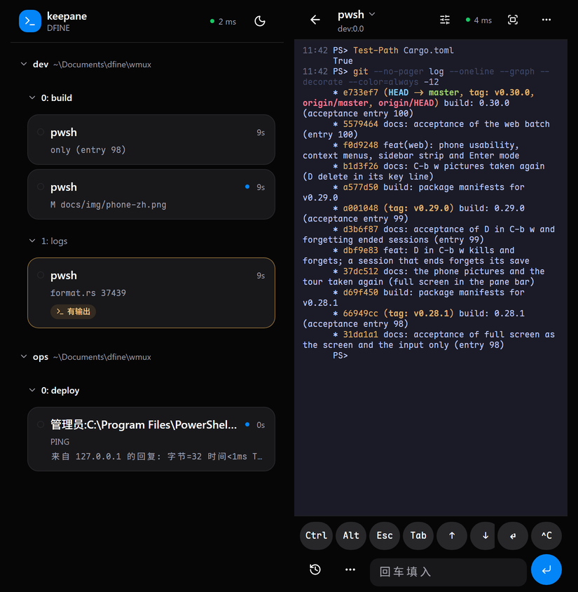

# keepane

[](https://github.com/newdee/keepane/actions/workflows/ci.yml)
[](https://github.com/newdee/keepane/releases)

[English](README.md) · **[功能一览 →](https://dfine.tech/keepane/)**

keepane 是一个终端多路复用器。关闭终端连接后，pane 里的程序继续运行；pane 之间还能通过收件箱传递消息。常用的 tmux 按键、命令和配置文件可以继续使用。

<p align="center">
  
</p>

- 脱离后，pane 里的程序继续运行。重启电脑后用 `keepane resume` 恢复布局；误关的 pane 可在 10 秒内按 `C-b u` 找回。
- 给 pane 命名后，就能向它发消息。消息先进入收件箱，等 pane 准备好再投递：shell 回到提示符时执行命令，其他程序主动读取。
- 每条消息都有固定格式的信封，记录发送方、接收方和任务。事件日志保留 30 天；按 `C-b v` 可查看 pane、消息和任务。
- 人、脚本和 AI agent 使用同一套消息机制；agent 也可通过内置的 MCP 服务端操作。
- 在手机上，通过 Wi-Fi 或 Tailscale，`keepane web` 可以查看所有窗口和 pane；在手机上输入的命令在电脑上执行。
- 支持 tmux 风格的 `C-b` 前缀、分屏、copy mode、命令行、配置写法（`keepane import-config` 可以导入现成的 `.tmux.conf`）、格式串、hook 和插件。

支持 Windows（ConPTY），pane 里可运行 PowerShell、WSL 和 cmd；也支持 Linux 和 macOS，pane 里可运行 bash 和 zsh。

## 在 pane 之间派活

每个 pane 都有收件箱，也可以设置名字。消息会排队等待，并按接收方的工作模式投递。

<p align="center">
  
</p>

```powershell
keepane rename-pane -t %3 builder          # 之后用 -t %builder 就能找到它
keepane set-work-mode -t %builder shell    # 它在提示符下执行收到的内容（在 keepane 外面运行；在 pane 里只能设它自己）
keepane send-message -t %builder -w 30 "cargo test"
#12 delivered to $1:@2.%3 (shell)
keepane trace-message 12 -w 600            # 等它做完：输出、成败
```

目标可以写成 `%7`（pane 编号）、`%builder`（名字），或 `$1:@2.%7`（session、窗口、pane；`whoami` 可查看）。完整地址同时限定了 pane 所在的位置；如果它被移到别的窗口，投递会失败。

pane 根据工作模式处理消息：

| 模式 | 什么时候算准备好 | 投递方式 |
|---|---|---|
| `normal`（默认） | 不自动接收 | 用 `read-message` 读取；窗口标记显示 `@` |
| `shell` | keepane 的提示符钩子检测到 shell 回到提示符 | 输入并执行命令 |
| `ai` | agent 的轮次结束 hook 调用 `pane-ready` | 作为提示词输入 |

用户在 pane 中输入后，keepane 会把它视为忙碌，直到收到下一次就绪信号，避免消息插入正在输入的内容。keepane 投递的命令运行期间如果有人按键，结束该命令的提示符也不会触发新消息；用户自己运行命令时提前输入的内容则无法由 keepane 阻止。

`ai` 模式下，如果 agent 已退出并重新出现 shell 提示符，消息不会投递。投递方式以发送时接收方的模式为准：发给 agent 的文本即使遇到模式切换，也不会作为 shell 命令执行。

每条消息都带一个字段固定的信封头，写明来源和路由：

```text
[keepane id=12 task=12 from=$1:@1.%3 name=lead mode=ai to=$1:@2.%7 via=shell hop=0]
```

每个字段是 `名字=值`，用空格隔开；值里不会有空格，程序按空格切开就能读回。`set -g message-envelope json` 改成把同样的字段写成一行 JSON（`{"keepane":1,"id":12,…}`，0.17 之前的写法）；事件日志一直用 JSON。

投给 shell 时，信封头放在命令前，写成不执行任何东西、又会留在历史里的形式：PowerShell 里是注释（`<# [keepane …] #> cargo test`），bash 和 zsh 里是 `:` 的参数（`: '[keepane …]'; cargo test`）。多行内容会合为一条命令执行，对应一个结果（bash 和 zsh 里取最后一行的结果）。投给 agent 时，内容由信封头、正文和结束行 `[keepane end=12]` 组成。`task` 将派发、执行和回复关联起来；`hop` 记录消息转发次数，超过 `message-hop-limit`（默认 8）便拒收，避免 agent 循环回信。

发送方能选的字段按名字给：`--to`（目标 pane，简写 `-t`）、`--re 12`（回复第 12 条消息，不写 `--to` 就发给它的发送方；`-r` 回复本 pane 正在处理的那条）、`--task 12`（接着第 12 号任务）。其余由 keepane 填：谁发的（`from`、`name`、`mode`）、编号、hop 和 `via`。发送方改不了它们，所以信封头可信，hop 上限也照样管用：

```powershell
keepane send-message --to %builder "cargo test"
keepane send-message --re 12 "测试通过了"                # 发给第 12 条的发送方
keepane send-message --to %lead --task 12 "还有一件事"
```

在 pane 内运行 `set-work-mode`，只能修改当前 pane；从外部终端、快捷键或 `C-b :` 命令行运行时，可以修改任意 pane。这样，pane 内的程序不能直接把别的 pane 切成自动执行消息的 `shell` 模式。改名、管理收件箱和关闭 pane 不受这条限制；关闭操作可在 10 秒内用 `C-b u` 撤销。此规则用于减少误操作，并非针对同一用户进程的安全隔离。

## dashboard

按 `C-b v`（弹窗）或运行 `keepane dashboard`（任意终端），像 lazygit 那样分面板显示。左边：`[1]` 所有 pane，按 session 分组，列出工作模式、空闲与否、收件箱、安静了多久、在跑的程序；`[2]` 所选 pane 的收件箱；`[3]` 任务。右边 `[0]` 是所选 pane：地址、目录、pid、跑了多久、它说自己在做什么，下面是它此刻的屏幕（带颜色）、回滚、事件，或某条消息、某个任务的全文。Tab、`1 2 3 0`、`h`/`l` 换面板，`j`/`k` 在面板里移动，`[`/`]` 切换右边的内容；鼠标可以点选和滚动；`?` 列出所有按键。

也能直接操作。对 pane：`s` 发消息、`r` 改名、`m` 改工作模式、`R` 标记就绪（解卡）、`o` 跳过去（顺带关掉弹窗）、`x` 关掉。对收件箱：`d` 删除排队消息（`u` 撤销）、`K`/`J` 上下移、`t` 放到最前、Enter 看全文。关 pane、删消息、把 pane 切到 `shell`（从此收到的文字会被当命令执行）这三样会先确认。设计见 [docs/design/dashboard.md](docs/design/dashboard.md)。

消息及 pane 状态变化会写入事件日志：`%LOCALAPPDATA%\keepane\events\<socket>\2026-09-26.jsonl`，保留 30 天（`event-log`、`event-log-days`、`event-log-max`）。`list-tasks`、`show-task`、`trace-message`、`list-events` 读的就是它。服务端停止时，未投递的消息会被丢弃，并留下日志记录。pane 名字和工作模式随 session 保存。设计细节见 [docs/design/mailbox.md](docs/design/mailbox.md)。

## 安装

keepane 的文件（日志、事件日志、会话存档、pane 历史）放在它的数据目录：Windows 上是 `%LOCALAPPDATA%\keepane`，Linux 上是 `~/.local/share/keepane`，macOS 上是 `~/Library/Application Support/keepane`。下文的路径按 Windows 写。

### Linux 和 macOS

用 [Homebrew](https://brew.sh) 安装（macOS 的 Apple 芯片和 Intel、Linux x86_64）：

```bash
brew install newdee/tap/keepane
```

以后用 `brew upgrade keepane` 升级。也可以从 [Releases](https://github.com/newdee/keepane/releases) 下载 `keepane-v<版本>-linux-x86_64.tar.gz`（静态编译，任何 x86_64 Linux 都能跑）、`keepane-v<版本>-macos-aarch64.tar.gz`（Apple 芯片）或 `keepane-v<版本>-macos-x86_64.tar.gz`（Intel），解压后把 `keepane` 放进 `PATH`：

```bash
tar xzf keepane-v<版本>-linux-x86_64.tar.gz
install keepane-v<版本>-linux-x86_64/keepane ~/.local/bin/
```

也可以从源码编译（见下）。server 监听的 socket 在 `$XDG_RUNTIME_DIR/keepane-<uid>/`（没有这个变量就用 `/tmp/keepane-<uid>/`），这个目录只有你自己能进。`keepane startup`、`keepane update` 和 Windows Terminal 配置是 Windows 上的功能：在 Linux 和 macOS 上，想登录时启动 server 就写进自己的登录脚本，升级按当初的安装方式来（`brew upgrade keepane`，或从 Releases 下载；`keepane update` 会告诉你用哪种）。

### Windows

需要 Windows 10 1809 或更新版本（支持 ConPTY）。从 [Releases](https://github.com/newdee/keepane/releases) 下载：

- `keepane-v<版本>-windows-x86_64.zip`：里面是一个目录 `keepane-v<版本>-windows-x86_64`，`keepane.exe` 在这个目录里。解压后将该目录加入 `PATH`。不需要管理员权限。
- `keepane-<版本>-windows-x86_64.msi`：安装到 `Program Files`，供所有用户使用，并加入系统 `PATH`；可在“应用和功能”中卸载。需要管理员权限（静默安装：`msiexec /i keepane-<版本>-windows-x86_64.msi /qn`）。
- `keepane-<版本>-windows-x86_64-user.msi`：只为当前用户安装，装到 `%LOCALAPPDATA%\Programs\keepane`，加入用户 `PATH`。安装和 `keepane update` 都不需要管理员权限，通过 SSH 也能装、能升级。

Scoop 可直接使用仓库中的清单安装 zip，无需管理员权限：

```powershell
scoop install https://raw.githubusercontent.com/newdee/keepane/master/packaging/scoop/keepane.json
```

通过 SSH 使用时，Windows 11 不允许 SSH 会话穿过普通用户创建的 junction，而 Scoop 的 `current` 目录正是一个 junction，shim 会报"无法遍历该路径，因为它包含不受信任的装入点"。让 Scoop 的 shim 直接指向版本目录：

```powershell
scoop config no_junction true
scoop reset keepane
```

通过 SSH 时，按机器安装的 MSI 需要在桌面上确认权限，没人能点；`keepane update` 遇到这种情况会直接说明，请改用按用户安装的 MSI、zip 或 Scoop。

WinGet 的清单（装 MSI）在 `packaging/winget/`，`winget validate` 通过；合进 winget-pkgs 之后 `winget install newdee.keepane` 就行，在那之前可以在克隆里 `winget install --manifest packaging/winget/manifests/n/newdee/keepane/<版本>`。细节见 `packaging/README.md`。

### 从源码编译

从源码编译需要 Rust 1.88 或更新版本：

```bash
cargo install --git https://github.com/newdee/keepane --locked   # 直接装最新的 master
cargo install --path .                                         # 本地克隆
```

构建 Windows 的 MSI 时，如果本机没有 WiX，脚本会临时下载：

```powershell
cargo build --release
pwsh -File installer/build-msi.ps1        # 产物在 target\keepane-<版本>-windows-x86_64.msi
```

## 日常用法

<p align="center">
  
</p>

<p align="center">
  
</p>

Windows 上，keepane 以 Windows 原生的 win32-input-mode 转发键盘事件，支持 PSReadLine 组合键、`Ctrl+Space`、`Shift+Enter`、带修饰键的方向键、中文输入法，以及 WSL 中的 vim 和 htop。可在 Windows Terminal、传统控制台、VS Code 终端和其他 Windows 控制台宿主中运行。Linux 和 macOS 上，它读取终端发来的按键序列（带修饰键的 xterm 按键、括号粘贴、SGR 鼠标），再像终端一样转给程序，所以任何兼容 xterm 的终端和 SSH 里都能用。

```bash
keepane                      # 新开一个 session 并进入
keepane new -s work          # 起个名字
keepane new -d -s bg htop    # 后台开一个跑 htop 的 session
keepane ls                   # 看看有哪些 session
keepane attach -t work       # 接回去（换一个终端窗口也行）
keepane send-keys -t work "git status" Enter
keepane capture-pane -p -t work   # 把 pane 上的文字打印出来（-S -200 连带回滚）
keepane kill-server
```

和 tmux 一样，命令名可以使用无歧义的前缀：`keepane att`、`keepane lsp`、`keepane splitw -h`。`keepane kill` 会被拒绝，因为有四个命令以它开头。`keepane list-commands` 列出全部；和 tmux 的逐条对照在 [docs/tmux-parity.md](docs/tmux-parity.md)，命令和按键都有。

批量创建 pane：`keepane split-window -N 3` 会再开三个并把窗口平铺（加 `-d` 焦点留在原处）。窗口太小放不下时，放得下的那些会留着，并告诉你开了几个。

进入 session 后，先按前缀键 `Ctrl+b`，再按下表中的键：

| 按键 | 作用 |
| --- | --- |
| `c` / `n` / `p` / `Tab` / `0-9` | 新窗口 / 下一个 / 上一个 / 刚才那个 / 按编号跳 |
| `,` / `&` | 重命名 / 关掉当前窗口 |
| `%` / `"` | 左右分 / 上下分 |
| `h` `j` `k` `l`（或方向键）/ `o` / `;` | 在 pane 之间移动（vim 键位）/ 下一个 pane / 刚才那个 pane |
| `H` `J` `K` `L`、`Alt`+方向键 / `Ctrl`+方向键 | 调整当前 pane 大小，每次 5 格 / 1 格 |
| `Shift`+方向键 | 窗口比这个终端大时（`window-size` 听了别的客户端），平移自己的视口，每次 5 行 / 10 列；敲键时视口自动跟着光标 |
| 移动、改大小、`n` / `p`、`{` / `}` 都能连按 | 按一次前缀之后半秒内（`repeat-time`）接着按同一个键就行，不用再按前缀 |
| `z` | 当前 pane 放大到整个窗口，再按一次还原；放大时切到同窗口的别的 pane（`h` `j` `k` `l`、`q` 加数字、`;`），放大会跟过去，直到再按 `z`（`set -g keep-zoom off` 则切换即还原，和 tmux 一样） |
| `x` | 关掉当前 pane |
| `u` | 把 10 秒内关掉的 pane 或窗口放回原处（`undo-kill`） |
| `C-t` | 在每条命令那一行的末尾显示开始时间、耗时和成败（`pane-timestamps`） |
| `/` | 按 pane 和日期翻看输出过的历史（`choose-history`） |
| `{` / `}` | 和前一个 / 后一个 pane 交换位置 |
| `q` | 每块显示自己的编号（有名字的在下面显示 `%名字`），按数字直接跳过去 |
| `Space` / `M-1`…`M-5` / `E` | 轮换布局 / 直接选一种（左右平分、上下平分、主窗在上、主窗在左、平铺）/ 把旁边这一排 pane 拉成等宽等高 |
| `C-o` / `M-o` | 让所有 pane 在布局里轮转一格 |
| `!` | 把当前 pane 拆成一个独立窗口 |
| `m` / `M` | 标记这个 pane / 取消标记（`join-pane` 默认搬走被标记的那个） |
| `T` / `f` | 给这个 pane 起名 / 按名字或标题找窗口 |
| `#` / `-` / `=` | 列出粘贴缓冲区 / 删掉最新的 / 挑一个粘贴 |
| `t` / `~` / `r` | 时钟 / 最近的提示消息 / 重画 |
| `S` | 开关 `synchronize-panes`：敲的东西同时进这个窗口的所有 pane，状态栏会多个 `S` |
| `[` / `PgUp` | copy mode（下面单独说） |
| `]` | 粘贴剪贴板 |
| `:` | 命令行（`:split-window -h -c C:\src`、`:set mouse off` 之类；Tab 补命令名、flag、`-t` 后的目标和选项名） |
| `C-s` / `C-r` | 手动保存当前 session / 恢复保存过的 session |
| `d` | 脱离 |
| `?` | 列出所有按键 |
| `s` / `w` | 弹出 session / 窗口列表挑一个：`j` `k`（或方向键）上下，`g` `G` 到头到尾，数字直接跳，`Enter` 选中，`q` 取消；`f` 输入子串过滤（边打边筛，`Enter` 留下，`Esc` 还原），`t` 给当前行打标记（`T` 清掉），`x` 杀掉标记的行（没标记就是当前行），`-` / `+`（或左右方向键）折叠、展开一个 session |
| `(` / `)` | 切到上一个 / 下一个 session |
| `D` | 列出连着的客户端，挑一个踢下线 |
| `>` / `<` | pane 菜单 / 窗口菜单（括号里的字母直接执行，`Enter` 执行选中那条） |
| `M-n` / `M-p` | 跳到下一个 / 上一个有提醒的窗口（见 `monitor-activity`） |

pane 放大、还原及焦点切换带有动画，默认持续 160 毫秒。程序仅按动画结束后的尺寸调整，不必等待动画完成。用 `set -g animation off` 关闭动画，或通过 `animation-time` 调整时长（毫秒）。

copy mode 的常用操作：

- 移动：`h` `j` `k` `l` 或方向键；`w` `b` `e` 按词移动；`0` `^` `$`、`H` `M` `L`、`{` `}`、`g` `G` 跳转。
- 翻页：`PageUp` / `PageDown` 或 `C-b` / `C-f`；`C-u` / `C-d` 翻半页。由于 `C-b` 也是前缀键，在 copy mode 中按 `C-b C-b` 可上翻一页。数字可指定重复次数，例如 `3j`。
- 选择与复制：`Space` 或 `v` 开始选择，`C-v` 切换矩形选择，`Enter` 或 `y` 复制到粘贴缓冲区和 Windows 剪贴板。
- 搜索：`/` 开始搜索、`?` 反向搜索，`n` / `N` 跳到下一个结果；`q` 退出。

脚本可用 `send-keys -X <命令名>` 执行对应操作，命令名与 tmux 相同。

鼠标可用于选择 pane、拖动边框调整大小，以及点击状态栏切换窗口。滚轮在普通界面上会进 copy mode 往回翻，在全屏程序里变成方向键，程序自己要鼠标事件的话就原样转过去。拖选一段文字，松手就复制到 Windows 剪贴板了；右键把剪贴板贴进 pane，和终端本身的右键一样。

## 命令时间和历史

<p align="center">
  
</p>

PowerShell、bash、zsh 的 pane 会通过 keepane 启动时装上的提示符钩子报告每条命令的运行情况（钩子在你自己的 `~/.bashrc` 或 `.zshrc` 之后加载，不改你的提示符）。bash 要 4.4 或更新：macOS 自带的 `/bin/bash`（3.2）不报告命令何时开始，所以它的 pane 没有命令时间，在它里面执行的消息也不会标出成功还是失败。按 `prefix C-t`（或 `set -g pane-timestamps on`），命令所在那一行的右端就会显示它什么时候开始、跑了多久、有没有失败：

```text
PS C:\src> cargo build                                     14:03:22 41s ✓
PS C:\src> cargo test                                      14:04:10 12s ✗
```

时间信息显示在行尾空白处，不改变 pane 宽度或程序输出；copy mode 和 `capture-pane` 不会包含这段信息。如果行尾空间不足，就不显示。脚本要用的话，`keepane list-marks` 打印同样的信息。手机上点 ⏱ 按钮，时间显示在左边一栏。

带脚本或命令启动的 shell（`pwsh -File`、`bash -c`）keepane 不去动它，也就没有 hook；可以在那个脚本里自己装上：PowerShell 里写 `Invoke-Expression (keepane __shell-hook | Out-String)`，bash 里写 `eval "$(keepane __shell-hook)"`。

别的 shell 用 Windows Terminal 和 VS Code 也认的那套序列（OSC 133）报告命令。WSL 里的 bash，或者 SSH 到别的机器上的 bash：

```bash
PS0='\e]133;C\e\\'
PROMPT_COMMAND='printf "\e]133;D;%s\e\\\e]133;A\e\\" "$?"'
```
pane 的输出也可保存到磁盘（`log-history`，默认开）：每个 pane 位置每天一个纯文本文件，放在 `%LOCALAPPDATA%\keepane\history\<session>\<窗口>.<pane>\2026-09-25.log`，留 30 天（`log-history-days`），每个文件每天最多 20 MB。一行字从 pane 顶上滚出去的时候才写，所以进度条、正在编辑的提示符只留下最后的样子；vim 这类全屏程序什么都不留；pane 关掉时屏幕上还剩的内容，那时一起写进去。报告过的命令前面有一行它的时间（`── 14:03:22 · 41s · ✓ ──`）。

`prefix /`（`choose-history`）列出有历史的 pane 位置和它们的日期。在某一天上按 Enter，就在弹出框里用查看器打开。查看器从末尾开始看，用法和 `less` 一样：`j` `k`、`Space` `b`、`g` `G`，`/` `?` 搜索，`n` `N` 找下一个，`[` `]` 在命令之间跳，`q` 退出。`keepane view 文件` 用它打开任何文件。`set -g log-history off` 就不记了。

用 `kill-pane` 或 `kill-window` 关掉的 pane 或窗口（`prefix x`、`prefix &`）会保留 10 秒，里面的程序继续跑。这期间按 `prefix u`（`undo-kill`）就放回原处。过了 10 秒就和以前一样彻底没了。秒数用 `undo-kill-time` 改；设成 0 就立刻结束，关程序是为了释放端口或文件的时候就该这样。一个 session 的最后一个 pane 不保留，因为 session 会跟着它一起结束。

## 重启之后接着用

每个 session 的结构（有哪些窗口、每个窗口怎么分的、每块里跑的是什么命令、在哪个目录）都会存成一个文件，放在 `%LOCALAPPDATA%\keepane\sessions` 下面。结构一变就存一次，`kill-server` 的时候也存。所以不管是重启、崩溃还是手滑 `kill-session`，文件都还在：

```powershell
keepane resume              # 把存过的 session 全恢复出来，进第一个
keepane resume work         # 只恢复 work（要是它本来就在跑，那就直接进去）
keepane list-saved          # 有哪些能恢复，最新的排前面
keepane delete-saved old    # 不要了
keepane save-session -a     # 现在就全存一遍（prefix C-s 存当前这个）
```

恢复出来的是布局、每个 pane 的启动命令、所在目录，还有每块屏幕上最后 `save-history` 行（默认 500 行；`set -g save-history all` 把整段 scrollback 连颜色一起存下来）的输出。程序当时跑到哪是回不来的，谁也做不到。存档是自动的：布局一变就存，pane 上的文字每 30 秒存一次，Windows 关机、重启、注销时再整个存一遍（server 会把关机拖住那一瞬间）；Linux 和 macOS 上 server 收到 SIGTERM 或 SIGHUP 时也一样。想让 server 一启动就自己恢复，配置里写 `set -g restore-on-start on`；不想存就 `set -g autosave off`；`sessions-dir` 可以换目录。

每个 PowerShell、bash、zsh pane 的命令历史（按 ↑ 翻出来的那些）也各自保存，放在会话存档目录下，所以恢复后的 pane 翻到的是它自己跑过的命令，而不是所有 pane 混在一起的。新开的 pane 会复制一份它来源的那个 pane 的历史（分屏时是被分的那个，新窗口时是当前在用的那个），没有来源就复制这个 shell 自己的历史文件。没有 pane、也没有存档再引用的历史文件，超过 `log-history-days` 天会被清掉。

想让这一切在登录 Windows 时自动发生：

```powershell
keepane startup on          # 登录时启动 server，把存过的 session 全恢复出来
keepane startup status      # 看看注册了什么
keepane startup off         # 取消
```

它只在当前用户的 `Run` 注册表键下写一个值，不需要管理员权限，也不碰任务计划；server 通过 `conhost --headless` 启动，登录时不会闪出控制台窗口。重启之后 `keepane attach` 进去，东西都在。

升级：装了新版 keepane，已经在跑的 server 不会被换掉。它还是旧程序，你的 session 都在它里面。

```powershell
keepane version          # 这个 keepane 的版本；server 版本不同时一并显示
keepane update --check   # 有没有新版
keepane update           # Windows：按当初的安装方式（MSI 或 scoop）装新版
keepane restart-server   # 把正在跑的 session 全部挪到新版本的 server
```

`restart-server` 会先存档正在跑的 session，停掉旧 server，起一个新版本的，再只恢复刚才在跑的那几个（布局、历史、目录都在）；接着的终端会自己重新接上（0.10 起；更老的 server 上的终端会被断开，`keepane attach` 接回去）。在 pane 里面运行时，它会跑到 pane 外面去完成，结果写进 `%LOCALAPPDATA%\keepane\restart.log`。选项和按键绑定会重新从配置文件读，和 `kill-server` 之后一样：之后用 `set` / `bind` 临时改的不会带过去（旧 server 分不清哪些是默认值、哪些是你改的，全搬过去会把旧版本的默认值钉在新版本上）。终端接着一个不同版本的 server 时，标题栏会提示。`update` 下载 MSI 后先核对旁边发布的 SHA-256 再交给 Windows Installer；任何安装都不会在后台偷偷进行。

server 每天会向 GitHub 查一次最新发布的版本号（用 `curl` 向 `api.github.com` 发一个请求，不发送任何关于你或你的 session 的信息）。如果比当前版本新，状态栏会显示出来（比如 `⇡ 0.19.0`，也就是格式变量 `#{keepane_update}`），`show-messages` 里也会说明怎么升级。查到的结果存在数据目录里，所以 server 重启后当天不会再查。不想让它联网，就 `set -g update-check off`（或者设置环境变量 `KEEPANE_NO_UPDATE_CHECK`）。

PowerShell、bash、zsh、fish 里的 Tab 补全（命令名、每条命令的 flag、`-t` 后面从运行中的 server 取 session / 窗口名、`set` / `show` 后面的选项名和取值；`splitw` 这样的别名、`split-w` 这样的前缀都按它代表的命令补）由程序自己吐出一段补全脚本，加一行就能用。PowerShell 里对别名成 `tmux` 的也有效。Windows PowerShell 5.1 不会拿 `-` 开头的词来问程序的补全脚本，所以那里 flag 只在 PowerShell 7 里能补。用 Homebrew 装的，bash、zsh、fish 的补全会自动装好。

```powershell
keepane completion powershell | Out-String | Invoke-Expression   # $PROFILE
```

```bash
eval "$(keepane completion bash)"                                # ~/.bashrc
source <(keepane completion zsh)                                 # ~/.zshrc，放在 compinit 之后
keepane completion fish > ~/.config/fish/completions/keepane.fish
```

keepane 里面 `:` 命令行按 Tab 也能补：命令名、输到 `-` 时这条命令的 flag（别名和前缀按它代表的命令算，已经写过的不再列）、`-t` 后面的目标、`set` / `show` 后面的选项名（缩写也行：`sync`、`mon-act`），以及只有几个取值的选项的值（`on`/`off`、`top`/`bottom`）；多个候选时补到相同的部分为止，候选列在提示符里。

PowerShell 默认不给 Ctrl+D 绑任何功能（bash 里是退出），所以它也关不掉 pane。想让它在空行上退出，在 `$PROFILE` 里加一行：

```powershell
Set-PSReadLineKeyHandler -Chord Ctrl+d -Function DeleteCharOrExit
```

想让 keepane 出现在 Windows Terminal 的下拉菜单里：

```powershell
keepane windows-terminal install    # 一个 "keepane" profile，打开就接上（或新建）名为 main 的 session
keepane windows-terminal status
keepane windows-terminal remove
```

这是一个 profile *片段*，也就是 keepane 自己的一个 JSON 文件，放在 `%LOCALAPPDATA%\Microsoft\Windows Terminal\Fragments\keepane\` 下，Windows Terminal 会把它合并进来，不碰你的 `settings.json`；重装也保持同一个 profile 身份，你给它改的字体、配色都还在。从它开的每个标签页都进同一个 session，和 `tmux new -A -s main` 一样。

### pane 记住自己在哪个目录

pane 的目录跟着 shell 的 `cd` 走，不用你配置：启动 PowerShell（pwsh 或 Windows PowerShell）、bash、zsh 时 keepane 挂一个 prompt 钩子，每次提示符后面追加一段不可见的 OSC 9;9 或 OSC 7 上报目录（你自己的 prompt、oh-my-posh 之类照旧）；`cmd.exe`、`sh` 和其他程序则直接读进程自己的工作目录。shell 自己上报的目录（OSC 9;9，带不带引号都行；WSL 里 bash/zsh 的 OSC 7）优先采信，`keepane set-cwd`（不带参数就是你运行它时所在的目录）可以手动指定，也可以 `keepane set-cwd -t work:0.1 D:\proj` 给别的 pane 指定。

WSL 里的 bash 用 OSC 7 上报，`/mnt/c/...` 这样的路径会自动映射回 `C:\...`：

```bash
PROMPT_COMMAND='printf "\e]7;file://%s%s\e\\" "$HOSTNAME" "$PWD"'
```

`list-panes` 能看到每个 pane 记的目录，状态栏里用 `#{pane_current_path}` 显示。

## 在 AI agent 里用

pane 里的 agent 收发的是和别人一样的消息。要让它顺畅，需要两样东西：一个在 agent 每轮结束时运行 `keepane pane-ready -q` 的 hook（这样 `ai` 模式的 pane 才算准备好了），以及 `keepane mcp`，一个把上面那些命令作为工具提供的 MCP 服务端（stdio）。它从 `KEEPANE_PANE` 知道自己服务的是哪个 pane，所以 agent 发出的消息，发送方就是这个 pane。

`keepane setup` 列出它认识的每个 agent：本机装没装、hook 和 keepane 的 MCP 服务端配好没有。`keepane setup <agent>` 打印这个 agent 需要的配置；加 `--install` 就替你装上，每个文件改之前先备份，只加 keepane 自己的条目：

| agent | `setup` 后面写 | hook（session 开始、每轮结束） | MCP 服务端 |
|---|---|---|---|
| Claude Code | `claude` | `~/.claude/settings.json` 里的 `SessionStart`、`Stop` | `claude mcp add --scope user` |
| Codex | `codex` | `~/.codex/hooks.json` 里的 `SessionStart`、`Stop` | `codex mcp add` |
| Gemini CLI | `gemini` | `~/.gemini/settings.json` 里的 `SessionStart`、`AfterAgent` | 同一个文件的 `mcpServers` |
| Cursor CLI | `cursor` | `~/.cursor/hooks.json` 里的 `sessionStart`、`stop` | `~/.cursor/mcp.json` |
| opencode | `opencode` | 一个插件 `~/.config/opencode/plugins/keepane.js`，启动时和 `session.idle` 时运行 | `opencode.json` 的 `mcp` |

hook 运行的都是 `keepane pane-ready -q`：在 keepane 之外什么也不做，在不是 `ai` 模式的 pane 里被忽略。Codex 的 `notify` 只能填一个程序，keepane 不碰它；Codex 的新 hook 要你在 Codex 里用 `/hooks` 确认信任一次才会运行。不是纯 JSON 的文件（比如带注释）不会被改，`setup` 会告诉你手工加什么。这些都按各家的文档写，端到端实测过的只有 Claude Code。自己手写 hook 时，程序路径不要加引号（或者写成 `& "C:\路径\keepane.exe" pane-ready -q`）：Windows 上 agent 可能用 PowerShell 执行 hook，在 PowerShell 里"带引号的路径后面跟参数"是语法错误。别的 agent 只要能在每轮结束时运行一条命令、能用 stdio 上的 MCP 服务端，也一样能接；启动它之前在它的 pane 里运行 `keepane set-work-mode ai`。

发给 `ai` 模式 pane 的消息，如果这个 pane 的 agent 启动以来从没报告过空闲，消息就会一直排队。所以 `send-message` 会直接说明，并给出补上 hook 的 `setup` 命令；dashboard 和手机页上也会提示（`#{pane_unheard}`）。

20 个工具：

| 工具 | 用途 |
|---|---|
| `whoami`、`list_panes` | 自己的 pane，以及所有 pane：地址、名字、模式、忙闲、收件箱、程序、状态 |
| `send_message`、`reply`、`wait_message`、`current_message` | 发消息、回复发送方、在一轮之内取下一条消息、查看正在处理的消息（以 keepane 记录的为准） |
| `list_messages`、`trace_message`、`drop_message`、`move_message` | 收件箱，以及一条消息后来怎样了（shell 命令的输出也在里面） |
| `create_session`、`create_window`、`split_pane`、`rename_pane`、`kill_pane` | 开 pane（可以带名字、模式和第一条消息），给任意 pane 改名、关掉任意 pane |
| `set_status`、`set_work_mode` | 报告自己在做什么（dashboard 上显示）；改自己 pane 的模式 |
| `list_tasks`、`show_task`、`query_events` | 消息链（任务）和事件日志 |

通过 MCP 开的 pane，没指定模式时：跑 `claude`、`codex`、`gemini`、`cursor-agent`、`opencode` 的是 `ai` 模式，跑 `pwsh`、`powershell`、`bash`、`zsh` 的是 `shell` 模式，其他是 `normal`。agent 能启动的程序限于 `agent-commands`（Windows 上是 `pwsh powershell claude codex`，其他系统是 `bash zsh sh claude codex`），它和它开的 pane 一共能开多少个受 `agent-pane-limit`（8）限制。Claude Code 调用你没放行过的 MCP 工具前会先问你。

## 在手机上用

编译、部署或者 AI 助手在电脑上跑着，人走开了也想看一眼、回一句：

```powershell
keepane web
```

终端里会打出一个二维码。手机连同一个网络，用相机扫一下，浏览器就打开一个页面：按 session、窗口分组列出所有 pane（session 名字旁边是它多数 pane 所在的目录）：每个 pane 的名字（大字显示；没起名字就显示程序自己设的标题，再没有就显示程序名），下面一行是在跑的程序，目录和 session 的不同时也写出来；最后输出的一行（不算提示符）、多久没有新输出；一个表示状态的小圆点（ai、shell 模式的 pane 空闲绿、忙黄，已退出红）、收件箱里排队的消息数，以及状态栏上那几个提醒标记（开了 `monitor-activity` 这类选项时：`#` 有输出，`!` 响铃，`~` 太久没动静），不用点进去就知道哪个任务跑完了。点进一个，就能看到它的屏幕，颜色都在；屏幕一有变化 keepane 就把新内容推过来，不用等刷新。在屏幕上左右滑动可以切到上一个、下一个 pane，点标题可以直接选一个。点"发送"只发输入框里的文字，不带回车；输入框空着时再点一次"发送"就是回车。输入框左边的 ☰ 可以调出发过的命令（☆ 设为常用，固定在最上面）。上面一排是手机键盘上没有的键（Esc、Tab、方向键、回车、Ctrl+C，更多的在 ⋯ 里）；先点 Ctrl 或 Alt，再输入一个字母，就是 Ctrl 或 Alt 加这个字母。右上角的 + 菜单可以分屏、开新窗口、关掉当前 pane；⏱ 按钮在左边加一栏，显示每条命令开始的时间（点一下看日期、耗时和退出码，见“命令时间和历史”一节）。点 session 或窗口可以折叠、展开（手机会记住），旁边的 ✎ 可以重命名。比手机屏幕宽的 pane，长行会在手机屏幕边缘自动换行（↩ 按钮可以关掉，适合全屏程序）。⤢ 按钮把 pane 适配到手机：它占满所在窗口，整个会话变成手机的行列数，vim、htop、agent 这类全屏程序就按手机的大小重画。适配期间，电脑和其他连着的手机看这个会话也是手机的大小（一个会话只有一个大小，页面和状态栏都会提示）；离开这个 pane、回到列表或者锁屏，就恢复原来的大小，没有手机看它 10 秒后 keepane 也会自动恢复。命令都在电脑上执行，手机只负责看和输入。“添加到主屏幕”之后，它打开起来就像一个 App。

<p align="center">
  
</p>

二维码里是地址加一个密钥，密钥每次启动重新生成（128 位随机数）。除了页面本身，没有密钥什么都拿不到；手机只能看、往 pane 里输入、用那个 + 菜单，发不了任何自己的 keepane 命令。不启动就不开。启动以后由 keepane 的 server 在后台提供服务，运行 `keepane web` 的终端马上就空出来了；它会一直开着，直到你关掉它或者 server 退出：

```powershell
keepane web status   # 地址，以及谁连着（在看哪个 pane）
keepane web stop     # 关掉；连着的手机随之断开
keepane web          # 开着的时候再运行一次：重新打出同一个二维码
```

想让它随 keepane 一直开着，就在 `~/.keepane.conf` 里加一行 `web-start -k`：server 启动时自己把它打开，每次都是同一个二维码（`-k` 见下）。

开着的时候，状态栏会显示 `web` 和当前连接数（自己配状态栏可以用 `#{web_url}` 和 `#{web_clients}`）；dashboard（`prefix v`）的 pane 列表标题上也显示同样的数字。有手机连上，或者有人用错误的密钥访问，状态栏都会提示。

```powershell
keepane web --read-only     # 只能看，不能输入
keepane web --keep-key      # 下次还用同一个二维码，收藏的网页一直能用
keepane web --port 8080 --bind 192.168.1.23   # 换端口，或者指定网卡
```

用的是普通 HTTP，适合自己家里的网络：在公共网络上，抓包的人能看到密钥。在外面想用，就在中间加一层 Tailscale 这类私有网络：`keepane web` 会同时监听本机的局域网地址和 Tailscale 地址（`web status` 会列出来）。第一次运行时 Windows 会问是否允许 keepane 联网，选“专用网络”允许即可。

## 跨电脑

两台电脑上的 pane 也能像同一台上那样互发消息，走的是 `keepane web` 监听的那个端口，前提是两边的 keepane server 配过对。做法和 SSH 的公钥一样：每个 server 有自己的一对密钥，还有一张“允许哪些机器进来”的表；配对就是把双方的公钥各写进对方的表里，只做一次。在要配对的那台机器上运行 `keepane web`，拿到它打出的地址（就是手机扫的那个，带密钥）；然后在这台上：

```powershell
keepane link add http://100.64.0.3:7681/#k=...     # 配对，一次双向生效
keepane link list                                  # 配过对的机器
keepane link panes 100.64.0.3:7681                 # 对方的 pane
keepane send-message --to 100.64.0.3:7681/%worker "run the tests"
```

对方的 pane 写成 `主机:端口/` 加上它在那台机器上的名字（`%worker`、`$1:@3.%7`）。消息到了那边，信封里的 `from=` 是这台机器和发送的 pane，所以那边用 `send-message -r` 回信就直接回到这里，并且归到同一个任务里。两边都要开着 `keepane web`；web 密钥只在配对那一次用到，之后每个请求都用 server 自己的密钥签名，所以 web 换了密钥也不影响。认的是公钥，不是地址：对方换个网络出现（从局域网换到 Tailscale），还是同一台机器。两边的时钟相差不能超过两分钟。

配过对的机器发来的消息只进 `ai` 和 `normal` 模式的 pane。要让它们在 `shell` 模式的 pane 里当命令执行，得在 keepane 之外的终端里给那台机器授权（不能在 pane 里面做，否则 agent 就能自己开权限）：

除了对方的 pane 列表，还能问到：

```powershell
keepane link info 100.64.0.3:7681              # 对方机器：主机名、系统、keepane 版本、开机多久、CPU、内存、pane 数
keepane trace-message 12 -w 60                 # 发过去的消息在那边怎么样了（shell 命令还有输出）
keepane link capture -S 100 100.64.0.3:7681/%worker   # 对方某个 pane 现在显示的内容（要对方授权 --screen）
```

```powershell
keepane link allow 100.64.0.3:7681 --shell     # --no-shell 收回
keepane link allow 100.64.0.3:7681 --screen    # 允许它读这边 pane 的屏幕；--no-screen 收回
keepane link remove 100.64.0.3:7681            # 解除配对，两边一起
keepane link trust 100.64.0.3:7681 <公钥>      # 手工加一台，公钥是它那边 `keepane link id` 打出来的
keepane link rekey                             # 换一对新密钥：所有配对都要重做
```

没授权的机器发给 `shell` pane 的消息会被拒收，发送方会看到怎么授权。`keepane web --read-only` 的机器也不收别的机器的消息。对方连不上时立刻报错，不会在本机排队等以后再发；加 `-w` 时由对方等到投递为止，时间到了还在排队就算超时（和发给本机 pane 一样，退出码非 0）。配对和解除配对会在状态栏提示并记进事件日志；被拒的请求也一样，但同一个地址一分钟只记一次，有人大量乱发时不会刷屏，也不会把事件日志写满。设计和每条决定见 [docs/design/link.md](docs/design/link.md)。

## 手册

`keepane man` 以 Markdown 格式打印完整手册（所有命令、默认按键、配置、环境变量和文件位置），内容就是 [docs/keepane.1.md](docs/keepane.1.md)，可以直接阅读，也可以交给程序或 AI 去读。`keepane man --roff` 把它输出成 man 页面；用 Homebrew 安装会自动装好，所以可以直接用 `man keepane` 查看。

## 配置

keepane 只读自己的配置，不会去读 `~/.tmux.conf`。想沿用 tmux 的配置，就手动导入一次：

```bash
keepane import-config -n     # 先看看会写进去什么，不改任何文件
keepane import-config        # 从 ~/.tmux.conf（或 ~/.config/tmux/tmux.conf）导入
keepane import-config some.conf -o ~/.keepane.conf   # 任何配置文件，写到指定位置
```

每一行都按 keepane 启动时读配置的方式试一遍。能用的原样写进去（续行和 `%if` 块保持原来的结构，每个分支都检验过）；用不了的以注释形式写进去，并注明原因：TPM 和所有 `@` 开头的插件设置（tmux 的插件在 keepane 里不会运行）、tmux 有而 keepane 用不上的选项（`escape-time`、`mode-keys` 这些）、给 `MouseDragEnd1Pane` 这类鼠标“键”的绑定（keepane 的鼠标行为是固定的）、会执行程序的命令（`run`、`if-shell`：导入时什么都不执行），以及 keepane 不接受的写法。导入写进 keepane 正在读的那个配置文件（一个都没有就新建 `~/.keepane.conf`），并告诉你写到了哪里；同一个文件导入过一次，再导入会被拒绝。已经在运行的 server 只在启动时读配置，用 `keepane source-file ~/.keepane.conf` 可以立刻生效。

配置文件是 `~/.keepane.conf`（也可以放 `~/.config/keepane/keepane.conf`，或者用 `KEEPANE_CONFIG` 环境变量指定；Windows 上 `~` 就是 `%USERPROFILE%`），一行一条命令，就是 tmux 那种写法：

```tmux
set -g prefix C-a
set -g default-shell wsl          # Windows：pwsh（默认）、powershell、wsl、cmd 或可执行文件路径；其他系统：$SHELL（默认）或路径
# set -g default-command "wsl.exe -d Ubuntu"
set -g mouse on
set -g history-limit 10000
set -g status-position top
set -g status-style fg=black,bg=colour39
set -g pane-active-border-style fg=colour39
set -g base-index 1               # 窗口和 pane 都从 1 开始编号
set -g pane-base-index 1
set -g repeat-time 500            # `bind -r` 的键在多久之内还能接着按；0 就是关掉

set -g remain-on-exit on          # 程序退出后 pane 留着，告诉你它是怎么没的
set -g save-history 500           # 每个 pane 存多少行给 `resume` 用；0 就是不存，all 是整段 scrollback
set -g monitor-activity on        # 后台窗口有输出就在状态栏标 `#`
set -g monitor-bell on            # 响铃标 `!`；默认就是开的
set -g monitor-silence 60         # 60 秒没动静标 `~`；0 是关掉
set -g visual-bell on             # 用状态栏提示代替真的响铃

set -g pane-timestamps on         # 每条命令的时间显示在行尾（prefix C-t 切换）
set -g log-history on             # 输出存盘，每个 pane 每天一个文件（prefix / 翻看）
set -g log-history-days 30        # 留几天；0 永久保留（log-history-dir 改存放位置）
set -g undo-kill-time 10          # 关掉的 pane / 窗口保留几秒可以找回（prefix u）；0 不保留
set -g keep-zoom off              # 切到别的 pane 就取消最大化，和 tmux 一样（on：最大化跟着走）
set -g animation off              # 不要焦点框飞过去的动画（animation-time 160：毫秒数，0 到 10000）

bind | split-window -h
bind - split-window -v
bind -r C-h resize-pane -L 5      # -r：按一次前缀之后可以连着按
bind -n M-Left previous-window     # -n：不用按前缀
bind -n M-Right next-window
bind r source-file ~/.keepane.conf

# 选项名和命令名一样可以缩写，只要不产生歧义：
# set sync          = set synchronize-panes（不给值就是切换）
# set mon-act on    = set monitor-activity on（按 - 分段各写前缀）
# set mou           = 翻转 mouse
# set mon           会报歧义，并列出三个 monitor-* 让你选

set -ag status-right " | keepane"    # -a 是往原值后面追加，不是覆盖
source-file ~/.keepane/themes/nord.conf
```

keepane 默认就是 Tokyo Night 的样子：会话名在蓝色色块上，当前窗口在紫色色块上，其他窗口标签是暗色，pane 边框很淡，当前 pane 用蓝色描边。仓库里的 `themes/` 还放了几套现成配色（Nord、Gruvbox dark、Dracula、Catppuccin Mocha），Tokyo Night 本身也有一份方便改，另外 `plain.conf` 是 tmux 那种朴素的绿色状态栏。它们就是普通的 keepane 命令文件，`source-file` 一下就行，想改直接改：

```tmux
source-file ~/.keepane/themes/dracula.conf
source-file ~/.keepane/themes/plain.conf   # 换回 tmux 的样子
```

默认外观用的是 24 位真彩色。在不支持真彩色的终端上（macOS 自带的 Terminal，除非它声明了 `COLORTERM=truecolor`），keepane 会自动换成 256 色里最接近的颜色，keepane 自己的界面和 pane 里程序的输出都一样。

`.tmux.conf` 里常见但 keepane 用不上的选项（`escape-time`、`focus-events` 这些）如果还是被设置了（比如用 `source-file` 读了一份 tmux 配置），会被接受然后忽略；`import-config` 不会导入它们。`default-terminal`（不设就是 `xterm-256color`）是 Linux 和 macOS 上 pane 拿到的 `TERM`；Windows 上终端由 ConPTY 安排，这个选项不起作用。

所有窗口和 pane 命令都支持 tmux 风格的 `-t`：`session`、`session:window`、`:window`、`session:window.pane`，窗口那一段可以是编号、名字、`+`、`-` 或 `!`。`%N` 是按编号指定 pane（`list-panes` 里显示的那个），别的 pane 增减时它指的还是同一个；`list-panes -F` 按格式串逐个 pane 输出。

### 状态栏

`set -g pane-border-status top`（或 `bottom`）会在每个 pane 的边框上放一行 `pane-border-format` 的内容，默认是 pane 编号和标题，当前 pane 加粗。

`status-left`、`status-right`、`window-status-format`、`window-status-current-format`、`pane-border-format` 接受 tmux 的格式串：`#S` session 名，`#W` 窗口名，`#I` 窗口编号，`#P` pane 编号，`#T` pane 标题，`#H` 主机名，`#F` 标记，`#{session_name}` 这种长写法，`#{?条件,真,假}` 条件（条件可以是变量名，也可以是 `变量==值` / `变量!=值`），`%H:%M` 之类的时间字段，`#[fg=colour39,bg=black,bold]` 改样式，还有 `#(命令)`：每隔 `status-interval` 秒（默认 15）跑一次，取输出的第一行（`display-message -p`、`jobs -F` 这种一次性命令会当场跑，最多等 3 秒）。`status-left-length` / `status-right-length` 限制长度。`status-justify left|centre|right|absolute-centre` 决定窗口列表放在哪，`window-status-separator` 是窗口标签之间的分隔（默认一个空格）。

```tmux
set -g status-right "#[fg=yellow]#(pwsh -NoProfile -c (Get-Date).ToString('HH:mm'))#[default] #H"
```

可用变量按类别列出：

- session：`session_name` `session_id` `session_windows` `session_attached` `session_created`
- window：`window_name` `window_id` `window_index` `window_panes` `window_active` `window_last_flag` `window_zoomed_flag` `window_width` `window_height` `window_bell_flag` `window_activity_flag` `window_silence_flag` `window_flags`
- pane：`pane_index` `pane_id` `pane_title` `pane_current_command` `pane_start_command` `pane_current_path` `pane_width` `pane_height` `pane_active` `pane_dead` `pane_dead_status` `pane_synchronized` `pane_in_mode` `pane_pid` `pane_start_time` `pane_activity` `pane_dead_time` `pane_last` `pane_mode` `pane_top` `pane_left` `pane_bottom` `pane_right` `pane_at_top` `pane_at_bottom` `pane_at_left` `pane_at_right` `cursor_x` `cursor_y` `history_size` `history_limit`
- client：`client_width` `client_height` `client_name` `client_session` `client_created` `client_activity` `client_prefix`
- server：`host` `host_short` `socket_path` `version` `pid`。另外还有 `session_activity` `session_last_attached` `window_activity` `window_start_flag` `window_end_flag` `window_layout`。

系统信息直接从进程读取，无需 `#(命令)`：`cpu_percentage` `ram_percentage` `ram_used` `battery_percentage`（没电池就是空）`battery_charging` `uptime`。其他常用变量：`git_branch`（pane 所在目录的分支，读 `.git` 得来，不在仓库里就是空）、`pane_current_path_short`（家目录写成 `~`）、`pane_pid_command`（pane 里此刻在跑的程序，编译时是 `cargo`）、`pane_output_count`（pane 输出过多少次；脚本比较前后两次的值就知道有没有新输出，只精确到秒的 `pane_activity` 做不到）。`keepane_update` 是每日检查发现的新版本号。

网络：`local_ip` 是本机上网所用的地址（向系统查询，不发送任何数据），`public_ip` 是外网看到的地址。后者只有外部服务知道，所以只有当某个正在显示的格式用到 `#{public_ip}` 时，keepane 才会去问（`api.ipify.org`，每 10 分钟一次）；没用到就不会问任何人。默认外观里两者都没有，想显示就加上：

```tmux
set -ag status-right " #{local_ip} #{public_ip}"
```

默认的 `status-right` 用的是系统信息那几个变量（完整写法见 `themes/tokyo-night.conf`，它就是默认外观；tmux 那种朴素的见 `themes/plain.conf`）；`set -g status-right ...` 整条换掉，`set -g status off` 整行关掉。

比较运算与 tmux 一样：`#{==:a,b}` `#{!=:a,b}` `#{<:a,b}` `#{>:a,b}` `#{<=:a,b}` `#{>=:a,b}` `#{&&:a,b}` `#{||:a,b}`、`#{m:通配符,文本}`（`m/i:` 忽略大小写）得到 `1` 或 `0`，可以做 `#{?…}` 的条件，也可以做配置文件里 `%if` 的条件。

修饰符也与 tmux 一样：`#{=10:pane_title}` 取前 10 个字符，`#{=-10:…}` 取后 10 个，`#{b:pane_current_path}` 取文件名部分，`#{d:…}` 取目录部分，`#{t:session_created}` 把时间戳显示成时间，`#{s/foo/bar/:…}` 替换，可以套着用（`#{=8:b:pane_current_path}`）。

## 插件

插件结构与 tmux 类似：一个目录，里面放一个 `<名字>.keepane`（或 `plugin.keepane`）写 keepane 命令，再放上它需要的脚本，什么语言都行。脚本要和 keepane 说话就调命令行：环境变量 `KEEPANE` 是 socket 名，`KEEPANE_PANE` 是所在 pane，所以脚本里写 `keepane -L $env:KEEPANE display-message ...` 就能找到对的 server。

```tmux
# ~/.keepane.conf
set -g plugin-path ~/.keepane/plugins       # 默认就是这里
set -g @plugin demo                       # 加载 ~/.keepane/plugins/demo/demo.keepane
set -g @plugin C:\src\my-plugin           # 也可以直接给路径（目录或文件）
```

插件文件里能用配置文件的全部命令，再加上：

- `run-shell [-b] [-t target] 命令`：通过 pwsh 跑一条命令，带着 keepane 的环境变量，跑完把输出显示出来（`-b` 就不管输出了）。
- `set-hook -g <钩子> <命令>`：某件事发生时执行一条命令。钩子有 `after-new-session`、`after-new-window`、`after-split-window`、`after-select-window`、`after-select-pane`、`after-kill-pane`、`client-attached`、`client-detached`、`pane-exited`。`set-hook -gu <钩子>` 取消，`show-hooks` 查看。
- `set -g @随便什么 值` 存一个插件自己用的选项，`show-options -gqv @随便什么` 读回来（脚本里：`keepane -L $env:KEEPANE show-options -gqv @随便什么`）。
- 状态栏里的 `#(命令)`，见上面。
- 运行时 `load-plugin 名字或路径`、`list-plugins`。

以下插件在状态栏显示 agent 任务进度，并用 `prefix A` 打开日志：

```tmux
# ~/.keepane/plugins/agent-status/agent-status.keepane
set -g status-right "#[fg=cyan]#(pwsh -NoProfile -File ~/.keepane/plugins/agent-status/summary.ps1)#[default] %H:%M"
set -g status-interval 5
bind A run-shell "pwsh -NoProfile -Command Get-Content $env:TEMP\agent.log -Tail 30"
```

脚本和按键绑定中还可使用这些命令（`keepane list-commands` 会全部列出来，命令名写前缀就行）：

- `pipe-pane [-o] [-I] [-O] [-t 目标] [命令]`：把 pane 打印的所有东西灌进一个命令的标准输入（`-O`，默认）；不给命令就是停。`keepane pipe-pane "$input | Add-Content build.log"` 就能一边编译一边留日志（PowerShell 会先把输入读完再跑，所以这个文件是管道停下时才写；想逐行落盘用 `cmd.exe /c findstr ... > 文件` 这种命令）。`-I` 反过来：命令打印什么就往 pane 里敲什么，命令输出完管道就结束（`-IO` 两个方向都要）。
- `wait-for [-L|-U|-S] 通道`：挂在那儿等别人发信号（或者解锁），两个脚本可以互相等：一边 `keepane wait-for ready`，另一边 `keepane wait-for -S ready` 放行。
- `display-menu [-T 标题] 名字 键 命令 ...`：在窗口上弹个菜单，名字给空字符串就是一条分隔线。`display-popup [-E] [-w 宽] [-h 高] [-x 列] [-y 行] [-d 目录] [命令]` 是在窗口上开个小框跑程序（`-E` 程序退出就关，`-C` 从外面关掉；`-x` / `-y` 可以是列号/行号、百分比、`C` 居中、`R` / `B` 贴右边/底边，不给就居中）。
- `choose-client`：列出连着的客户端，选一个踢下线。
- `send-keys -X <copy 命令>`：用脚本开 copy mode 干活（`search-backward`、`begin-selection`、`copy-selection` ……名字和 tmux 一样）。
- `capture-pane -p [-e] [-J] [-S -N]`：把 pane 的内容打出来，`-e` 连颜色一起，`-J` 把被折行的长行拼回一行，`-S -N` 带上 N 行回滚（`-S -` 全部）。
- `find-text 关键词`：在所有 pane 打印过的内容里找，告诉你在哪个 pane、往回第几行：`ft:0.0  -8  REDIS-TIMEOUT-here`。`-C` 区分大小写，`-t` 限定 session 或窗口，`-n` 限制每个 pane 最多几条。keepane 的 `find-window` 只搜窗口名和标题。
- `jobs`：任务板。整个 server 上每个 pane 一行：程序还在跑还是已经退出（退出码多少）、跑了多久、多久没有输出、pid、命令、目录。`-t session` 只看一个 session；`-F 格式` 自己定输出（`#{pane_start_time}`、`#{pane_activity}`、`#{pane_dead_time}` 是原始时间戳）。`prefix B`（`choose-jobs`）是同一张板的可操作版：`Enter` 跳到那个 pane，`x` 杀掉，`r` 重启，开着的时候行会原地刷新。

  ```
  PANE       STATE    UP     IDLE   PID    COMMAND       DIR
  build:0.0  running  2h13m  4s     21608  cargo build   C:\src\keepane
  web:0.0    exit 1   2h13m  1h02m  28748  npm run dev   C:\src\site
  ```
- `record [-t 目标] out.cast`：从现在起把这个 pane 打印的一切写成 [asciinema](https://asciinema.org) v2 文件（连窗口尺寸变化一起）；`record -t 目标` 不带路径就是停。`asciinema play` 能回放，也能上传或嵌进网页。
- `notify [-T 标题] 消息`：弹一个 Windows 桌面通知（toast，通知中心里以 keepane 自己的名字出现）；`set -g notify on` 之后每次告警都弹，终端被别的窗口盖住时也能收到。告警的通知带一个“Go to pane”按钮：点了打开一个 `keepane://` 链接，执行 `focus-pane`，让所有接着的客户端切到那个 pane 并把窗口提到前面（尽力而为：Windows Terminal 不一定允许别的进程把它拉到前台）。第一次弹 toast 会在 `HKCU\Software\Classes` 下登记两个键（AppUserModelID 和 `keepane:` 协议），不碰系统范围；弹不出 toast 时退回托盘气泡。
- `focus-pane %N`：单独用这条命令，所有接着的客户端都切到 pane `%N`（`list-panes` 和 `#{pane_id}` 显示的那个 id）。

窗口和 pane 相关的命令都接受 `-t 目标`，写法和 tmux 一样：`session`、`session:窗口`、`:窗口`、`session:窗口.pane`，窗口那段可以是编号、名字，也可以是 `+`、`-`、`!`。只有 `select-pane` 例外，它的 `-t` 跟的是要跳到哪个 pane（`next`、`last` 或编号），和 `-L` `-R` `-U` `-D` 是一类。

## 它是怎么工作的

`keepane` 命令本身是客户端。首次运行会启动后台 server（`keepane __server`），由 server 管理所有 session。两者通过按用户隔离的通道通信：Windows 上是命名管道（`\\.\pipe\keepane-<用户名>-<socket>`），其他系统上是 Unix socket（`keepane-<uid>/<socket>`，位置见“安装”）；用 `-L` 指定 socket。

每个 pane 使用一个伪终端（Windows 上是 ConPTY）。server 用 `vt100` 维护终端画面，将可见 pane、边框和状态栏合成一帧，只向客户端发送变化的格子；客户端再用 VT 序列写入控制台。最后一个 session 结束后，server 退出。Windows 上，server 启动时会尽可能脱离创建它的 job，避免从 SSH 启动时随连接断开而退出；Linux 和 macOS 上，server 自成一个会话，终端或 SSH 连接挂断的信号到不了它。

pane 里能看到两个环境变量：`KEEPANE`（socket 名）和 `KEEPANE_PANE`（pane 编号）。在 pane 里敲 `keepane` 命令会自动连到管着这个 pane 的 server（和 tmux 用 `$TMUX` 一个道理），所以 `keepane ls` 之类不用再写 `-L`。server 日志位于 `%LOCALAPPDATA%\keepane\server.log`，`KEEPANE_LOG=debug` 会记得更详细。超过 5 MB 会改名为 `server.log.1` 再开新文件，跑几个月的 server 日志也最多占 10 MB 左右。

如果按键没有响应（例如前缀键），可在同一终端运行 `keepane show-keys` 再按它：每按一个键，会打印控制台交过来的是什么、keepane 把它认成哪个键，按 `q` 退出。什么都没打印，说明是外面托管终端的程序自己把键吃掉了（比如 VS Code 自己绑了 `Ctrl+B`）。有些宿主把输入当字节转交而不是键盘事件（SSH、一些远程工具），`Ctrl+B` 到这里只是字符 0x02、不带 Ctrl 标志；keepane 按 tmux 的读法解读控制字符，所以它照样是 `C-b`。

命名管道带了只允许当前用户（和 SYSTEM）访问的 DACL，相当于 tmux 那个 0700 的 socket 目录（Unix socket 用的就是这样的目录）。Windows 上每个 pane 都跑在一个 kill-on-close 的 job object 里，其他系统上 pane 的整个会话会被一起挂断，所以 `kill-pane`、`kill-session`、server 退出都会把整棵进程树带走，不留孤儿。客户端写控制台慢的时候，server 不会无限缓冲帧，而是直接改成全量重绘。

`vendor/vt100` 是 vt100 0.16.2 加了一处修复：pane 缩小时刚好切到一个宽字符（比如中文）会越界，详见 `vendor/vt100/KEEPANE-PATCH.md`。server 里任何一条命令 panic 都会记到日志里然后继续跑，不会把 session 全丢了。

## 开发

```bash
cargo test              # 单元测试 + 端到端测试（Windows 上拉起 cmd.exe，其他系统上拉起 sh）
cargo clippy --all-targets
```

CI 在 Windows、Linux、macOS 上都跑这两步。平台相关的代码在 `src/platform/windows` 和 `src/platform/unix`，两边模块一一对应（见 `docs/design/platform.md`）。Windows 上 `tests/console.rs` 会把真的 `keepane.exe` 塞进一个 ConPTY 里跑，所以控制台那条路（raw 模式、备用屏幕、脱离时的清理）不用人坐在键盘前也能测到。

## 还没做的

Linux 和 macOS 上暂时没有 `keepane startup`（登录时启动 server）、`keepane update`（只提示怎么升级，用 Homebrew 装的就提示 `brew upgrade keepane`）和带“跳到 pane”按钮的桌面通知。

与 tmux 相比，目前有这些差异：

- 多个客户端连接同一 session 时，共享窗口尺寸。`window-size latest|smallest|largest|manual` 决定采用最近使用、最小、最大客户端的尺寸，或只接受 `resize-window` 手动设置。较小的客户端显示自己的视口，可用 `Shift`+方向键（`refresh-client -U/-D/-L/-R`）平移；输入时视口跟随光标。
- hook 仅支持前文列出的事件；`choose-tree` 按子串过滤，不支持 tmux 格式串过滤。
- `display-popup` 中，前缀键仍归 keepane 处理；连按两次可将前缀键发送给弹窗中的程序。

pane 消息：`shell` 工作模式依赖 keepane 的提示符钩子（PowerShell、bash、zsh），所以 cmd、sh、fish 和 WSL 里的 shell 暂时不会自己接收消息（可以用 `read-message` 取）；keepane 0.15 之前启动的 pane 用的是旧钩子，要重开才行。dashboard 还没有上手机页面。

命令和按键逐条对照见 `docs/tmux-parity.md`。

## 原名 wmux

0.13.1 及以前的版本名为 wmux。由于 GitHub、winget 和 crates.io 上已有同名项目，0.14.0 起更名为 keepane。名字取自 keep + pane：终端断开后，pane 中的程序继续运行。

从 wmux 过来：

- `keepane migrate` 一次搬完：还在运行的 wmux 服务端里的会话（先存盘、停掉旧服务端，再在 keepane 里恢复，布局、历史、目录都在；里面的程序会重新启动，和 `restart-server` 一样），wmux 存在 `%LOCALAPPDATA%\wmux` 下的东西（会话存档、历史记录、手机端密钥），开机启动、Windows Terminal 的 profile、通知链接。如果 keepane 里已经有同名会话，wmux 的那个会以 `<名字>-wmux` 恢复在旁边，两个都保留。wmux 服务端还在运行时启动 keepane，会提示你这件事。
- 你的 `~/.wmux.conf` 照样生效，`WMUX_*` 环境变量、`~/.wmux/plugins` 和 `*.wmux` 插件文件也都认，想改名时再改成 `~/.keepane.conf`、`KEEPANE_*`、`~/.keepane/plugins`、`*.keepane`。
- MSI 会替换掉"应用和功能"里的 wmux。`wmux update` 已经找不到新版了，请从 Releases 手动装一次 keepane。用 scoop 的话：`scoop uninstall wmux`，再装 keepane 的清单（见“安装”一节）。
- 仓库搬到了 github.com/newdee/keepane（旧链接会跳转过去），网站在 dfine.tech/keepane。
- `$PROFILE` 里的 `tmux` 或 `wmux` 别名要改成指向 keepane。
